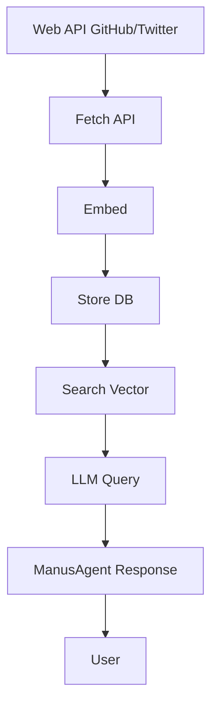

# AI/ML Tools for Embeddings Search and Web Integration

Building on the SQL database tools, these 5 AI/ML tools enable embeddings-based search over documents and integrate web APIs (GitHub, Twitter) for fetching data, embedding it, storing in DB, and querying semantically with LLM (ManusAgent) support. Focus on local execution (no external vector DB like Pinecone; use FAISS for local index, SQL for metadata).

## 1. EmbeddingsSearchTool
**Description**: Embed a query and search stored documents using vector similarity in a local FAISS index. Store documents with metadata in SQL DB (title, URL, embedding as blob or array). Use sentence-transformers for embedding.

**Required Parameters**:
- connection_id: From SQLConnect (SQL DB for metadata).
- query: String query to search.
- top_k: Integer, number of most similar results.

**Optional Parameters**:
- index_name: String, FAISS index name (default 'doc_index').
- embedding_model: String, sentence-transformers model (default 'all-MiniLM-L6-v2').

**MCP Feasibility**: High; sentence-transformers (lightweight ~90MB), faiss-cpu for search, SQLAlchemy integration. MCP server for distributed index if needed later.

**Implementation Notes**: Implemented in [`app/tool/ai_ml_tools.py`](app/tool/ai_ml_tools.py). Uses lazy loading of SentenceTransformer model on first execute, dynamic FAISS IndexFlatIP built from DB embeddings on-the-fly (no persistent index yet), cosine similarity via L2 normalization and Inner Product. Creates 'documents' table dynamically if missing (SQLite BLOB for pickled numpy arrays, 384-dim vectors). Returns top_k results with metadata and scores. Tests in [`app/tool/tests/test_ai_ml_tools.py`](app/tool/tests/test_ai_ml_tools.py) verify table creation, search with sample ML/programming docs (high similarity for "machine learning"), and empty DB/fail cases.

## 2. GitHubRepoEmbedTool
**Description**: Fetch GitHub repo contents (files, code) via API, embed with sentence-transformers, store embeddings and metadata (repo name, file path, URL) in SQL DB for later search.

**Required Parameters**:
- repo_owner: String, GitHub username/org.
- repo_name: String, Repository name.
- connection_id: From SQLConnect.

**Optional Parameters**:
- files_pattern: String, glob pattern for files to fetch (default '**/*.py' for code).
- embedding_model: String, as above.

**MCP Feasibility**: Medium; PyGithub for API (auth via token env), embed content, insert to DB. Rate limit handling with tweepy-like backoff.

**Implementation Notes**: Use GitHub API v3 to list files, read raw, truncate long content, embed, store with blob embedding.

## 3. TwitterDataEmbedTool
**Description**: Fetch tweets from Twitter API v2, embed text/content, store with metadata (tweet ID, text, author, URL) in SQL DB for sentiment/similarity search.

**Required Parameters**:
- query: String search query.
- count: Integer, number of tweets (default 100).
- connection_id: From SQLConnect.

**Optional Parameters**:
- embedding_model: String, as above.

**MCP Feasibility**: Medium; Tweepy for API (bearer token required), embed tweet text, store timestamped.

**Implementation Notes**: Search recent tweets, embed, insert batch to DB. Sentiment optional with vaderSentiment.

## 4. WebToDBEmbedWorkflow
**Description**: Combined tool: Fetch from web API (GitHub/Twitter), embed results, store in DB. Chain to EmbeddingsSearchTool for immediate search.

**Required Parameters**:
- source: String, 'github' or 'twitter'.
- source_query: Dict with source-specific params (repo for GitHub, query for Twitter).
- connection_id: From SQLConnect.

**Optional Parameters**:
- embedding_model: String, as above.

**MCP Feasibility**: High; compose GitHubRepoEmbedTool and TwitterDataEmbedTool internally, then call EmbeddingsSearchTool.

**Implementation Notes**: Route to respective tool, then search/store pipeline.

## 5. ManusMLQuery
**Description**: Semantic Q&A over embedded data: Embed query, search DB/FAISS, pass top results to LLM (via CreateChatCompletion or langchain) for response generation with ManusAgent.

**Required Parameters**:
- query: String user question.
- connection_id: From SQLConnect.
- llm_prompt: String, optional prompt for LLM (default "Answer based on the following context: {context}").

**Optional Parameters**:
- top_k: Integer, number of docs to retrieve (default 3).

**MCP Feasibility**: High; langchain chain: Retrieve from EmbeddingsSearchTool, format context, call LLM, return answer.

**Implementation Notes**: Use langchain chains for LLM call, integrate with existing prompt tools.

## Evaluation Feasibility
- **Dependencies**: sentence-transformers (embeddings), faiss-cpu (local vector search), langchain/langchain-community (LLM chaining), PyGithub (GitHub API), tweepy (Twitter API).
- **Storage**: SQL table with columns: id (PK), title (TEXT), url (TEXT), content (TEXT), embedding (BLOB for numpy array).
- **Models**: 'all-MiniLM-L6-v2' (384 dim, fast/light).
- **Limitations**: Local FAISS index (add index build tool), Twitter API needs bearer token in env, GitHub personal access token optional for rate limits.
- **Integration with ManusAgent**: Tools can be added to agent.available_tools for chaining in agents like manus.py.
- **Performance**: For 10k docs, search ~100ms on CPU; embed ~50ms per doc.

## Workflow Diagram

This enables ML x Web x ManusAgent workflows: fetch from APIs, embed/store, query semantically.
