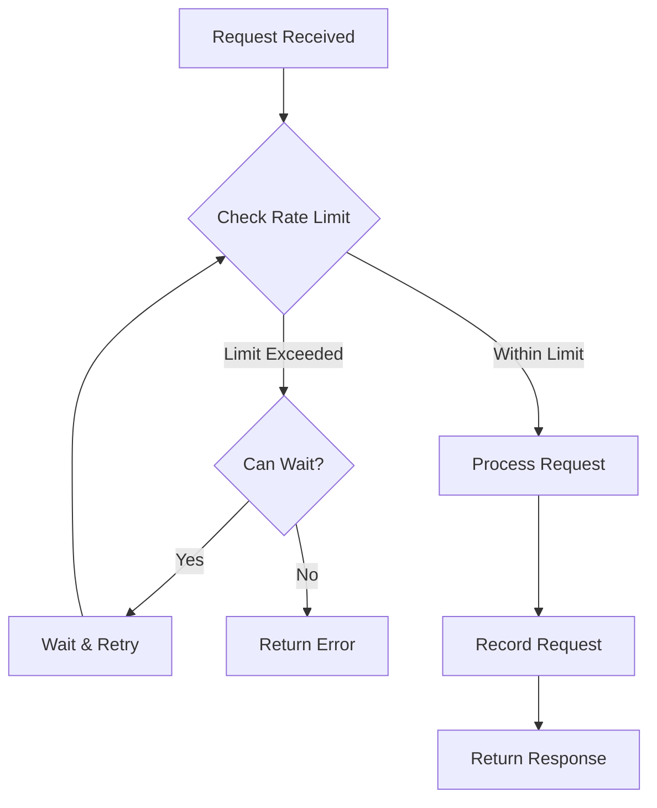
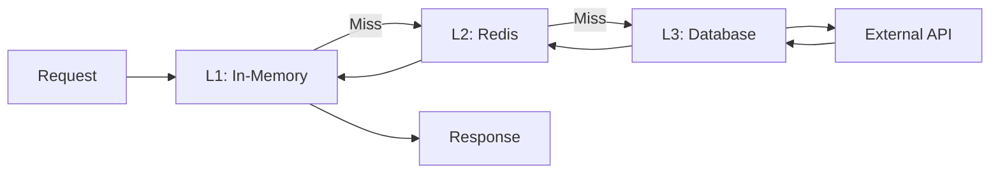

# Monetization Tools - Technical Architecture Deep Dive

## Table of Contents
1. [Shared Infrastructure](#shared-infrastructure)
2. [Rate Limiting Strategy](#rate-limiting-strategy)
3. [Caching Architecture](#caching-architecture)
4. [Database Design](#database-design)
5. [Error Handling Patterns](#error-handling-patterns)
6. [Security Considerations](#security-considerations)
7. [Performance Optimization](#performance-optimization)
8. [Monitoring & Observability](#monitoring--observability)

---

## Shared Infrastructure

### MonetizationBase Class - Complete Implementation

```python
"""
app/tool/monetization/base.py
Base class providing shared functionality for all monetization tools.
"""

from abc import abstractmethod
from typing import Any, Dict, List, Optional
from datetime import datetime, timedelta
import asyncio
import json
import hashlib

from pydantic import Field
from app.tool.base import BaseTool, ToolResult
from app.tool.browser_use_tool import BrowserUseTool
from app.tool.web_search import WebSearch
from app.tool.crawl4ai import Crawl4aiTool
from app.tool.create_chat_completion import CreateChatCompletion
from app.tool.sql_manager import SQLManager, get_connection
from app.logger import logger


class RateLimitConfig:
    """Rate limit configuration for external APIs."""

    LIMITS = {
        # Marketplace platforms
        'amazon': {'requests_per_minute': 60, 'requests_per_hour': 3000},
        'ebay': {'requests_per_minute': 100, 'requests_per_hour': 5000},
        'aliexpress': {'requests_per_minute': 30, 'requests_per_hour': 1000},

        # Freelance platforms
        'upwork': {'requests_per_minute': 20, 'requests_per_hour': 500},
        'fiverr': {'requests_per_minute': 30, 'requests_per_hour': 800},

        # Lead/data sources
        'linkedin': {'requests_per_minute': 10, 'requests_per_hour': 200},
        'hunter_io': {'requests_per_minute': 30, 'requests_per_hour': 1000},
        'clearbit': {'requests_per_minute': 50, 'requests_per_hour': 2000},

        # Domain services
        'whois': {'requests_per_minute': 60, 'requests_per_hour': 3000},
        'moz': {'requests_per_minute': 10, 'requests_per_hour': 200},

        # Default for unknown services
        'default': {'requests_per_minute': 30, 'requests_per_hour': 1000}
    }


class CacheConfig:
    """Cache TTL configuration."""

    TTL = {
        'product_price': 3600,        # 1 hour
        'lead_data': 86400,           # 24 hours
        'domain_metrics': 43200,      # 12 hours
        'company_info': 86400,        # 24 hours
        'project_listing': 1800,      # 30 minutes
        'api_response': 300,          # 5 minutes
        'default': 3600               # 1 hour
    }


class MonetizationError(Exception):
    """Base exception for monetization tools."""
    pass


class RateLimitError(MonetizationError):
    """Rate limit exceeded."""
    pass


class ValidationError(MonetizationError):
    """Input validation failed."""
    pass


class ExternalAPIError(MonetizationError):
    """External API call failed."""
    pass


class MonetizationBase(BaseTool):
    """
    Base class for all monetization tools.

    Provides:
    - Rate limiting
    - Caching
    - Error handling
    - Database operations
    - Logging
    - Common utilities
    """

    # Shared tool instances (initialized once per tool)
    browser_tool: Optional[BrowserUseTool] = Field(default=None)
    search_tool: Optional[WebSearch] = Field(default=None)
    crawl_tool: Optional[Crawl4aiTool] = Field(default=None)
    chat_tool: Optional[CreateChatCompletion] = Field(default=None)

    # SQL connection
    sql_manager: Optional[SQLManager] = Field(default=None)
    connection_id: Optional[str] = Field(default=None)

    # Rate limiting state (in-memory, per instance)
    _rate_limit_state: Dict[str, List[float]] = Field(default_factory=dict)

    # Cache state (in-memory, per instance)
    _cache: Dict[str, tuple] = Field(default_factory=dict)  # key -> (value, expiry)

    class Config:
        arbitrary_types_allowed = True

    def __init__(self, **data):
        """Initialize with lazy-loaded tools."""
        super().__init__(**data)
        # Tools will be initialized on first use

    # ==================== Tool Initialization ====================

    def _get_browser_tool(self) -> BrowserUseTool:
        """Lazy-load browser tool."""
        if self.browser_tool is None:
            self.browser_tool = BrowserUseTool()
        return self.browser_tool

    def _get_search_tool(self) -> WebSearch:
        """Lazy-load search tool."""
        if self.search_tool is None:
            self.search_tool = WebSearch()
        return self.search_tool

    def _get_crawl_tool(self) -> Crawl4aiTool:
        """Lazy-load crawl tool."""
        if self.crawl_tool is None:
            self.crawl_tool = Crawl4aiTool()
        return self.crawl_tool

    def _get_chat_tool(self) -> CreateChatCompletion:
        """Lazy-load chat completion tool."""
        if self.chat_tool is None:
            self.chat_tool = CreateChatCompletion()
        return self.chat_tool

    # ==================== Rate Limiting ====================

    async def check_rate_limit(self, resource: str) -> bool:
        """
        Check if request is within rate limits.

        Args:
            resource: Resource name (e.g., 'amazon', 'linkedin')

        Returns:
            True if allowed, False if rate limited
        """
        now = datetime.now().timestamp()
        limits = RateLimitConfig.LIMITS.get(resource, RateLimitConfig.LIMITS['default'])

        # Initialize state if needed
        if resource not in self._rate_limit_state:
            self._rate_limit_state[resource] = []

        # Clean old timestamps
        minute_ago = now - 60
        hour_ago = now - 3600
        self._rate_limit_state[resource] = [
            ts for ts in self._rate_limit_state[resource]
            if ts > hour_ago
        ]

        # Check limits
        recent_minute = [ts for ts in self._rate_limit_state[resource] if ts > minute_ago]
        recent_hour = self._rate_limit_state[resource]

        if len(recent_minute) >= limits['requests_per_minute']:
            logger.warning(f"[{self.name}] Rate limit reached for {resource}: "
                         f"{len(recent_minute)}/min")
            return False

        if len(recent_hour) >= limits['requests_per_hour']:
            logger.warning(f"[{self.name}] Rate limit reached for {resource}: "
                         f"{len(recent_hour)}/hour")
            return False

        return True

    async def wait_for_rate_limit(self, resource: str, max_wait: int = 60):
        """
        Wait until rate limit allows the request.

        Args:
            resource: Resource name
            max_wait: Maximum seconds to wait

        Raises:
            RateLimitError: If max_wait exceeded
        """
        start_time = datetime.now()
        while not await self.check_rate_limit(resource):
            elapsed = (datetime.now() - start_time).total_seconds()
            if elapsed > max_wait:
                raise RateLimitError(
                    f"Rate limit for {resource} exceeded, max wait time {max_wait}s reached"
                )
            await asyncio.sleep(1)

    def record_request(self, resource: str):
        """Record a request for rate limiting."""
        now = datetime.now().timestamp()
        if resource not in self._rate_limit_state:
            self._rate_limit_state[resource] = []
        self._rate_limit_state[resource].append(now)

    # ==================== Caching ====================

    def _cache_key(self, prefix: str, **kwargs) -> str:
        """Generate cache key from parameters."""
        key_data = json.dumps(kwargs, sort_keys=True)
        key_hash = hashlib.md5(key_data.encode()).hexdigest()
        return f"{prefix}:{key_hash}"

    async def cache_get(self, key: str) -> Optional[Any]:
        """
        Get value from cache.

        Args:
            key: Cache key

        Returns:
            Cached value or None if expired/missing
        """
        if key in self._cache:
            value, expiry = self._cache[key]
            if datetime.now().timestamp() < expiry:
                logger.debug(f"[{self.name}] Cache hit: {key}")
                return value
            else:
                # Clean expired entry
                del self._cache[key]
                logger.debug(f"[{self.name}] Cache expired: {key}")
        return None

    async def cache_set(self, key: str, value: Any, ttl: Optional[int] = None):
        """
        Set value in cache.

        Args:
            key: Cache key
            value: Value to cache
            ttl: Time to live in seconds (None for default)
        """
        if ttl is None:
            ttl = CacheConfig.TTL['default']

        expiry = datetime.now().timestamp() + ttl
        self._cache[key] = (value, expiry)
        logger.debug(f"[{self.name}] Cached: {key} (TTL: {ttl}s)")

    async def cache_invalidate(self, key: str):
        """Invalidate cache entry."""
        if key in self._cache:
            del self._cache[key]
            logger.debug(f"[{self.name}] Cache invalidated: {key}")

    # ==================== Database Operations ====================

    async def db_execute(self, query: str, params: Optional[dict] = None) -> Any:
        """
        Execute database query.

        Args:
            query: SQL query
            params: Query parameters

        Returns:
            Query result
        """
        if not self.connection_id:
            raise MonetizationError("Database connection not initialized")

        engine = get_connection(self.connection_id)

        try:
            with engine.connect() as conn:
                result = conn.execute(query, params or {})
                conn.commit()
                return result
        except Exception as e:
            logger.error(f"[{self.name}] Database error: {e}", exc_info=True)
            raise MonetizationError(f"Database operation failed: {e}")

    async def db_fetch_one(self, query: str, params: Optional[dict] = None) -> Optional[dict]:
        """Fetch single row from database."""
        result = await self.db_execute(query, params)
        row = result.fetchone()
        return dict(row) if row else None

    async def db_fetch_all(self, query: str, params: Optional[dict] = None) -> List[dict]:
        """Fetch all rows from database."""
        result = await self.db_execute(query, params)
        return [dict(row) for row in result.fetchall()]

    # ==================== Validation ====================

    def validate_required_params(self, params: dict, required: List[str]):
        """
        Validate required parameters are present.

        Args:
            params: Parameter dictionary
            required: List of required parameter names

        Raises:
            ValidationError: If required parameter missing
        """
        missing = [r for r in required if r not in params or params[r] is None]
        if missing:
            raise ValidationError(f"Missing required parameters: {', '.join(missing)}")

    def validate_url(self, url: str) -> bool:
        """Validate URL format."""
        import re
        pattern = re.compile(
            r'^https?://'  # http:// or https://
            r'(?:(?:[A-Z0-9](?:[A-Z0-9-]{0,61}[A-Z0-9])?\.)+[A-Z]{2,6}\.?|'  # domain
            r'localhost|'  # localhost
            r'\d{1,3}\.\d{1,3}\.\d{1,3}\.\d{1,3})'  # IP
            r'(?::\d+)?'  # optional port
            r'(?:/?|[/?]\S+)$', re.IGNORECASE)
        return bool(pattern.match(url))

    def validate_email(self, email: str) -> bool:
        """Validate email format."""
        import re
        pattern = re.compile(r'^[a-zA-Z0-9._%+-]+@[a-zA-Z0-9.-]+\.[a-zA-Z]{2,}$')
        return bool(pattern.match(email))

    # ==================== ROI Calculation ====================

    def calculate_roi(
        self,
        revenue: float,
        costs: float,
        initial_investment: float = 0
    ) -> Dict[str, Any]:
        """
        Calculate return on investment metrics.

        Args:
            revenue: Total revenue
            costs: Operating costs
            initial_investment: Initial investment

        Returns:
            Dictionary with ROI metrics
        """
        total_investment = initial_investment + costs
        profit = revenue - costs
        net_profit = revenue - total_investment

        roi = (net_profit / total_investment * 100) if total_investment > 0 else 0
        profit_margin = (profit / revenue * 100) if revenue > 0 else 0

        return {
            'revenue': round(revenue, 2),
            'costs': round(costs, 2),
            'profit': round(profit, 2),
            'net_profit': round(net_profit, 2),
            'roi_percentage': round(roi, 2),
            'profit_margin': round(profit_margin, 2),
            'breakeven': total_investment > 0
        }

    # ==================== Logging Helpers ====================

    def log_action(self, action: str, **kwargs):
        """Log tool action with structured data."""
        logger.info(f"[{self.name}] {action}", extra={'data': kwargs})

    def log_error(self, error: str, **kwargs):
        """Log error with context."""
        logger.error(f"[{self.name}] {error}", extra={'data': kwargs}, exc_info=True)

    def log_metric(self, metric_name: str, value: Any):
        """Log performance metric."""
        logger.info(f"[{self.name}] Metric: {metric_name}={value}")

    # ==================== Abstract Methods ====================

    @abstractmethod
    async def execute(self, **kwargs) -> ToolResult:
        """Execute the tool with given parameters."""
        pass
```

---

## Rate Limiting Strategy

### Implementation Details



### Rate Limit Storage

**In-Memory Approach** (Current):
- Fast, no external dependencies
- Lost on restart (acceptable for rate limiting)
- Per-instance state (good for development)

**Redis Approach** (Production):
```python
import redis
from datetime import datetime

class RedisRateLimiter:
    def __init__(self, redis_client: redis.Redis):
        self.redis = redis_client

    async def check_limit(self, resource: str, limit: int, window: int) -> bool:
        """
        Check rate limit using Redis sliding window.

        Args:
            resource: Resource identifier
            limit: Max requests
            window: Time window in seconds
        """
        key = f"rate_limit:{resource}"
        now = datetime.now().timestamp()
        window_start = now - window

        # Remove old entries
        self.redis.zremrangebyscore(key, 0, window_start)

        # Count recent requests
        count = self.redis.zcard(key)

        if count >= limit:
            return False

        # Add current request
        self.redis.zadd(key, {str(now): now})
        self.redis.expire(key, window)

        return True
```

---

## Caching Architecture

### Cache Layers



### Cache Key Strategy

```python
class CacheKeyBuilder:
    """Build consistent cache keys."""

    @staticmethod
    def product_price(platform: str, product_id: str) -> str:
        return f"price:{platform}:{product_id}"

    @staticmethod
    def lead_data(email: str) -> str:
        # Hash email for privacy
        email_hash = hashlib.sha256(email.encode()).hexdigest()[:16]
        return f"lead:{email_hash}"

    @staticmethod
    def domain_metrics(domain: str) -> str:
        return f"domain:{domain.lower()}"
```

### Cache Invalidation Patterns

1. **Time-based**: Automatic expiry (TTL)
2. **Event-based**: Invalidate on data update
3. **Manual**: Admin triggers
4. **Cascade**: Related keys invalidated together

---

## Database Design

### Schema Organization

```
monetization_db/
├── arbitrage/          # Marketplace arbitrage tables
│   ├── products
│   ├── price_history
│   └── listings
├── data_service/       # Data collection tables
│   ├── jobs
│   ├── collected_data
│   └── clients
├── leads/             # Lead generation tables
│   ├── leads
│   ├── lead_sources
│   └── enrichment_log
├── freelance/         # Freelance automation tables
│   ├── projects
│   ├── proposals
│   └── results
├── domains/           # Domain flipping tables
│   ├── expired_domains
│   ├── domain_metrics
│   └── registrations
└── clients/           # Client prospecting tables
    ├── companies
    ├── contacts
    └── outreach_log
```

### Indexing Strategy

```sql
-- High-cardinality columns (selective queries)
CREATE INDEX idx_arbitrage_profit ON arbitrage_products(profit_margin DESC, status);
CREATE INDEX idx_leads_score ON leads(lead_score DESC, qualification_status);

-- Composite indexes (common query patterns)
CREATE INDEX idx_projects_quality ON freelance_projects(platform, quality_score DESC);
CREATE INDEX idx_domains_value ON expired_domains(tld, estimated_value DESC);

-- Partial indexes (filtered queries)
CREATE INDEX idx_active_jobs ON data_collection_jobs(next_run)
WHERE status = 'active';

-- JSON indexes (JSONB columns)
CREATE INDEX idx_data_schema ON data_collection_jobs USING GIN(data_schema);
```

### Connection Pooling

```python
from sqlalchemy import create_engine
from sqlalchemy.pool import QueuePool

def create_monetization_engine(database_url: str):
    """Create database engine with connection pooling."""
    return create_engine(
        database_url,
        poolclass=QueuePool,
        pool_size=20,          # Normal connections
        max_overflow=10,       # Extra connections under load
        pool_timeout=30,       # Wait 30s for connection
        pool_recycle=3600,     # Recycle connections every hour
        echo=False             # Disable SQL logging
    )
```

---

## Error Handling Patterns

### Exception Hierarchy

```python
MonetizationError (base)
├── ValidationError
├── RateLimitError
├── ExternalAPIError
│   ├── MarketplaceAPIError
│   ├── FreelancePlatformError
│   └── DataSourceError
├── DatabaseError
├── CacheError
└── AuthenticationError
```

### Retry Strategy

```python
from tenacity import retry, stop_after_attempt, wait_exponential

class RetryableOperation:
    """Wrapper for operations with retry logic."""

    @retry(
        stop=stop_after_attempt(3),
        wait=wait_exponential(multiplier=1, min=2, max=10),
        reraise=True
    )
    async def fetch_with_retry(self, url: str):
        """Fetch URL with exponential backoff retry."""
        # Implementation
        pass
```

### Circuit Breaker

```python
from datetime import datetime, timedelta

class CircuitBreaker:
    """Prevent cascading failures."""

    def __init__(self, failure_threshold: int = 5, timeout: int = 60):
        self.failure_threshold = failure_threshold
        self.timeout = timeout
        self.failures = 0
        self.last_failure_time = None
        self.state = 'closed'  # closed, open, half-open

    def record_success(self):
        """Record successful operation."""
        self.failures = 0
        self.state = 'closed'

    def record_failure(self):
        """Record failed operation."""
        self.failures += 1
        self.last_failure_time = datetime.now()

        if self.failures >= self.failure_threshold:
            self.state = 'open'

    def can_attempt(self) -> bool:
        """Check if operation can be attempted."""
        if self.state == 'closed':
            return True

        if self.state == 'open':
            # Check if timeout elapsed
            if (datetime.now() - self.last_failure_time).seconds >= self.timeout:
                self.state = 'half-open'
                return True
            return False

        # Half-open: allow one attempt
        return True
```

---

## Security Considerations

### API Key Management

```python
import os
from cryptography.fernet import Fernet

class SecureConfig:
    """Secure configuration management."""

    def __init__(self):
        # Encryption key from environment
        key = os.getenv('MONETIZATION_ENCRYPTION_KEY')
        if not key:
            raise ValueError("Encryption key not configured")
        self.cipher = Fernet(key.encode())

    def encrypt_api_key(self, api_key: str) -> str:
        """Encrypt API key for storage."""
        return self.cipher.encrypt(api_key.encode()).decode()

    def decrypt_api_key(self, encrypted_key: str) -> str:
        """Decrypt API key for use."""
        return self.cipher.decrypt(encrypted_key.encode()).decode()
```

### Input Sanitization

```python
import bleach
import re

class InputSanitizer:
    """Sanitize user inputs."""

    @staticmethod
    def sanitize_url(url: str) -> str:
        """Sanitize URL input."""
        # Remove dangerous protocols
        url = re.sub(r'^(javascript|data|vbscript):', '', url, flags=re.IGNORECASE)
        return url.strip()

    @staticmethod
    def sanitize_html(html: str) -> str:
        """Sanitize HTML content."""
        allowed_tags = ['p', 'br', 'strong', 'em', 'a']
        allowed_attrs = {'a': ['href']}
        return bleach.clean(html, tags=allowed_tags, attributes=allowed_attrs)

    @staticmethod
    def sanitize_sql_identifier(identifier: str) -> str:
        """Sanitize SQL identifier (table/column name)."""
        # Only allow alphanumeric and underscore
        if not re.match(r'^[a-zA-Z_][a-zA-Z0-9_]*$', identifier):
            raise ValidationError(f"Invalid identifier: {identifier}")
        return identifier
```

---

## Performance Optimization

### Batch Processing

```python
class BatchProcessor:
    """Process operations in batches."""

    def __init__(self, batch_size: int = 100):
        self.batch_size = batch_size

    async def process_batch(self, items: List[Any], processor):
        """Process items in batches."""
        results = []

        for i in range(0, len(items), self.batch_size):
            batch = items[i:i + self.batch_size]
            batch_results = await processor(batch)
            results.extend(batch_results)

            # Small delay between batches to avoid overwhelming
            await asyncio.sleep(0.1)

        return results
```

### Async Concurrency

```python
import asyncio

class ConcurrentFetcher:
    """Fetch multiple resources concurrently."""

    async def fetch_many(
        self,
        urls: List[str],
        max_concurrent: int = 10
    ) -> List[Any]:
        """Fetch multiple URLs with concurrency limit."""
        semaphore = asyncio.Semaphore(max_concurrent)

        async def fetch_with_sem(url):
            async with semaphore:
                return await self.fetch_one(url)

        tasks = [fetch_with_sem(url) for url in urls]
        return await asyncio.gather(*tasks, return_exceptions=True)
```

---

## Monitoring & Observability

### Metrics Collection

```python
from datetime import datetime
from typing import Dict, Any

class MetricsCollector:
    """Collect tool performance metrics."""

    def __init__(self):
        self.metrics = {}

    def record_operation(
        self,
        tool_name: str,
        operation: str,
        duration_ms: float,
        success: bool,
        **tags
    ):
        """Record operation metrics."""
        key = f"{tool_name}.{operation}"

        if key not in self.metrics:
            self.metrics[key] = {
                'count': 0,
                'success_count': 0,
                'total_duration_ms': 0,
                'tags': {}
            }

        self.metrics[key]['count'] += 1
        if success:
            self.metrics[key]['success_count'] += 1
        self.metrics[key]['total_duration_ms'] += duration_ms

        # Store tag counts
        for tag_key, tag_value in tags.items():
            if tag_key not in self.metrics[key]['tags']:
                self.metrics[key]['tags'][tag_key] = {}
            tag_dict = self.metrics[key]['tags'][tag_key]
            tag_dict[tag_value] = tag_dict.get(tag_value, 0) + 1

    def get_stats(self, tool_name: str = None) -> Dict[str, Any]:
        """Get statistics for tool(s)."""
        if tool_name:
            return {
                k: v for k, v in self.metrics.items()
                if k.startswith(tool_name)
            }
        return self.metrics
```

### Health Checks

```python
class HealthChecker:
    """Monitor tool health."""

    async def check_health(self, tool: MonetizationBase) -> Dict[str, Any]:
        """Perform health check on tool."""
        checks = {
            'database': await self._check_database(tool),
            'cache': await self._check_cache(tool),
            'external_apis': await self._check_external_apis(tool)
        }

        overall_healthy = all(c['healthy'] for c in checks.values())

        return {
            'tool_name': tool.name,
            'healthy': overall_healthy,
            'timestamp': datetime.now().isoformat(),
            'checks': checks
        }

    async def _check_database(self, tool: MonetizationBase) -> Dict[str, Any]:
        """Check database connectivity."""
        try:
            await tool.db_execute("SELECT 1")
            return {'healthy': True, 'message': 'Database connection OK'}
        except Exception as e:
            return {'healthy': False, 'message': str(e)}
```

---

## Configuration Management

### Environment-based Configuration

```python
from pydantic import BaseSettings

class MonetizationSettings(BaseSettings):
    """Configuration settings for monetization tools."""

    # Database
    DATABASE_URL: str
    DATABASE_POOL_SIZE: int = 20

    # Cache
    REDIS_URL: str = "redis://localhost:6379/0"
    CACHE_TTL_DEFAULT: int = 3600

    # Rate Limiting
    RATE_LIMIT_ENABLED: bool = True

    # API Keys (encrypted)
    AMAZON_API_KEY: str = ""
    UPWORK_API_KEY: str = ""
    HUNTER_IO_API_KEY: str = ""

    # Feature Flags
    ENABLE_MARKETPLACE_ARBITRAGE: bool = True
    ENABLE_LEAD_GENERATION: bool = True

    # Monitoring
    METRICS_ENABLED: bool = True
    LOG_LEVEL: str = "INFO"

    class Config:
        env_file = ".env"
        case_sensitive = True
```

---

## Testing Infrastructure

### Mock Factory Pattern

```python
class MonetizationMockFactory:
    """Generate realistic mock data for testing."""

    @staticmethod
    def create_product(override: dict = None) -> dict:
        """Create mock product data."""
        product = {
            'id': 'PROD123',
            'title': 'Test Product',
            'price': 29.99,
            'platform': 'amazon',
            'rating': 4.5,
            'reviews_count': 150,
            'url': 'https://amazon.com/test'
        }
        if override:
            product.update(override)
        return product

    @staticmethod
    def create_lead(override: dict = None) -> dict:
        """Create mock lead data."""
        lead = {
            'id': 1,
            'company_name': 'Test Corp',
            'email': 'test@example.com',
            'industry': 'Technology',
            'lead_score': 85
        }
        if override:
            lead.update(override)
        return lead
```

---

This completes the technical architecture deep dive. The implementation will use these patterns consistently across all 6 tools.
