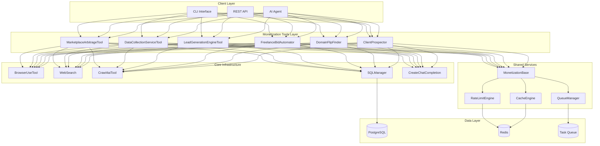
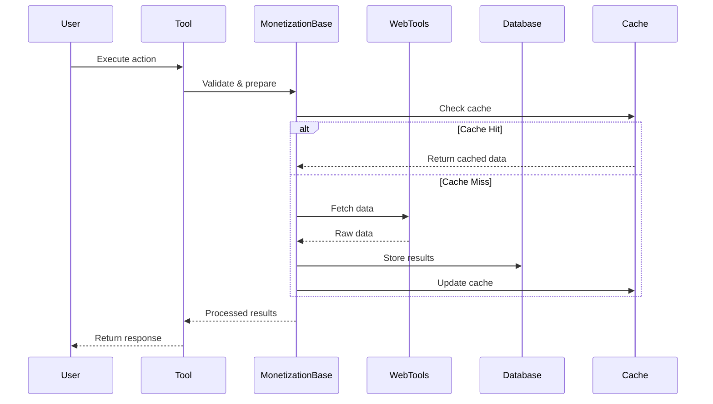

# Monetization Tools Suite - Architecture & Implementation Plan

## Overview

This document outlines the architecture and implementation plan for 6 monetization-focused tools designed to enable rapid revenue generation through automation. The suite includes:

**Core Tools (from proposal):**
1. MarketplaceArbitrageTool - Product arbitrage across e-commerce platforms
2. DataCollectionServiceTool - B2B data-as-a-service
3. LeadGenerationEngineTool - Qualified lead discovery and enrichment

**New Tools (Gig Economy + Digital Assets):**
4. FreelanceBidAutomator - Automated bidding on Upwork/Fiverr projects
5. DomainFlipFinder - Expired domain discovery with traffic/value analysis
6. ClientProspector - High-value client discovery and outreach automation

---

## System Architecture

### High-Level Component Diagram



### Data Flow Architecture



---

## Tool Specifications

### 1. MarketplaceArbitrageTool

**Purpose:** Automate product arbitrage across multiple e-commerce platforms

**Key Features:**
- Multi-platform price monitoring (Amazon, eBay, AliExpress, Walmart)
- Profit calculation with fees and shipping
- Listing automation
- Inventory synchronization
- Competition analysis

**Data Schema:**
```sql
CREATE TABLE arbitrage_products (
    id SERIAL PRIMARY KEY,
    source_platform VARCHAR(50),
    source_url TEXT,
    source_price DECIMAL(10,2),
    target_platform VARCHAR(50),
    target_price DECIMAL(10,2),
    estimated_fees DECIMAL(10,2),
    estimated_profit DECIMAL(10,2),
    profit_margin DECIMAL(5,2),
    product_title TEXT,
    category VARCHAR(100),
    rating DECIMAL(3,2),
    review_count INT,
    shipping_time INT,
    last_checked TIMESTAMP,
    status VARCHAR(20),
    created_at TIMESTAMP DEFAULT NOW()
);

CREATE INDEX idx_profit_margin ON arbitrage_products(profit_margin DESC);
CREATE INDEX idx_status ON arbitrage_products(status);
```

**API Methods:**
- `find_opportunities()` - Scan platforms for arbitrage products
- `calculate_profit()` - Calculate ROI with all fees
- `create_listing()` - Auto-generate optimized listings
- `sync_inventory()` - Update stock levels across platforms
- `monitor_competition()` - Track competitor pricing

---

### 2. DataCollectionServiceTool

**Purpose:** Provide data-as-a-service by collecting and structuring web data

**Key Features:**
- Custom data extraction with validation
- Multiple export formats (CSV, JSON, API)
- Scheduled recurring collection
- Data enrichment with AI
- Quality assurance and deduplication

**Data Schema:**
```sql
CREATE TABLE data_collection_jobs (
    id SERIAL PRIMARY KEY,
    client_id VARCHAR(50),
    job_type VARCHAR(50),
    target_sources TEXT[],
    data_schema JSONB,
    collection_frequency VARCHAR(20),
    last_run TIMESTAMP,
    next_run TIMESTAMP,
    records_collected INT DEFAULT 0,
    status VARCHAR(20),
    created_at TIMESTAMP DEFAULT NOW()
);

CREATE TABLE collected_data (
    id SERIAL PRIMARY KEY,
    job_id INT REFERENCES data_collection_jobs(id),
    raw_data JSONB,
    cleaned_data JSONB,
    quality_score DECIMAL(3,2),
    collected_at TIMESTAMP DEFAULT NOW(),
    exported BOOLEAN DEFAULT FALSE
);

CREATE INDEX idx_job_status ON data_collection_jobs(status, next_run);
CREATE INDEX idx_collected_data_job ON collected_data(job_id);
```

**API Methods:**
- `create_job()` - Define data collection job
- `execute_collection()` - Run extraction
- `validate_data()` - Apply validation rules
- `enrich_data()` - AI-powered enhancement
- `export_data()` - Export in various formats

---

### 3. LeadGenerationEngineTool

**Purpose:** Automated lead discovery, qualification, and enrichment

**Key Features:**
- Multi-source prospect discovery
- Contact enrichment (email, phone, LinkedIn)
- AI-powered lead scoring
- Email validation
- CRM integration

**Data Schema:**
```sql
CREATE TABLE leads (
    id SERIAL PRIMARY KEY,
    company_name VARCHAR(200),
    contact_name VARCHAR(200),
    job_title VARCHAR(100),
    email VARCHAR(200),
    phone VARCHAR(50),
    linkedin_url TEXT,
    company_website TEXT,
    industry VARCHAR(100),
    company_size VARCHAR(50),
    location VARCHAR(200),
    technologies_used TEXT[],
    lead_score INT,
    qualification_status VARCHAR(20),
    email_verified BOOLEAN DEFAULT FALSE,
    discovered_at TIMESTAMP DEFAULT NOW(),
    last_enriched TIMESTAMP
);

CREATE TABLE lead_sources (
    id SERIAL PRIMARY KEY,
    lead_id INT REFERENCES leads(id),
    source_type VARCHAR(50),
    source_url TEXT,
    confidence_score DECIMAL(3,2)
);

CREATE INDEX idx_lead_score ON leads(lead_score DESC);
CREATE INDEX idx_qualification_status ON leads(qualification_status);
```

**API Methods:**
- `discover_leads()` - Find prospects matching criteria
- `enrich_contact()` - Add contact information
- `score_lead()` - Calculate qualification score
- `validate_email()` - Verify email deliverability
- `export_to_crm()` - Push to external systems

---

### 4. FreelanceBidAutomator

**Purpose:** Automate bidding on freelance platforms (Upwork, Fiverr)

**Key Features:**
- Project monitoring based on criteria
- AI-powered proposal generation
- Bid optimization (pricing, timing)
- Success rate tracking
- Client qualification

**Data Schema:**
```sql
CREATE TABLE freelance_projects (
    id SERIAL PRIMARY KEY,
    platform VARCHAR(50),
    project_id VARCHAR(100),
    title TEXT,
    description TEXT,
    budget_min DECIMAL(10,2),
    budget_max DECIMAL(10,2),
    budget_type VARCHAR(20),
    client_rating DECIMAL(3,2),
    client_spend_total DECIMAL(10,2),
    client_reviews_count INT,
    skills_required TEXT[],
    posted_at TIMESTAMP,
    quality_score INT,
    bid_submitted BOOLEAN DEFAULT FALSE,
    won BOOLEAN DEFAULT FALSE,
    discovered_at TIMESTAMP DEFAULT NOW()
);

CREATE TABLE bid_proposals (
    id SERIAL PRIMARY KEY,
    project_id INT REFERENCES freelance_projects(id),
    proposal_text TEXT,
    bid_amount DECIMAL(10,2),
    estimated_hours INT,
    submitted_at TIMESTAMP,
    client_response VARCHAR(20),
    won BOOLEAN DEFAULT FALSE
);

CREATE INDEX idx_project_quality ON freelance_projects(quality_score DESC);
CREATE INDEX idx_bid_status ON bid_proposals(won, submitted_at);
```

**API Methods:**
- `scan_projects()` - Monitor new project postings
- `evaluate_project()` - Score profitability
- `generate_proposal()` - AI-powered bid creation
- `submit_bid()` - Automated submission
- `track_results()` - Analyze win rates

---

### 5. DomainFlipFinder

**Purpose:** Discover valuable expired domains for flipping

**Key Features:**
- Expired domain monitoring
- Traffic analysis (backlinks, previous traffic)
- SEO metrics evaluation
- Domain value estimation
- Bulk registration assistance

**Data Schema:**
```sql
CREATE TABLE expired_domains (
    id SERIAL PRIMARY KEY,
    domain_name VARCHAR(255) UNIQUE,
    tld VARCHAR(20),
    expiry_date DATE,
    previous_traffic_estimate INT,
    backlink_count INT,
    domain_authority INT,
    page_authority INT,
    archive_snapshots INT,
    estimated_value DECIMAL(10,2),
    registration_cost DECIMAL(10,2),
    potential_profit DECIMAL(10,2),
    categories TEXT[],
    status VARCHAR(20),
    discovered_at TIMESTAMP DEFAULT NOW()
);

CREATE TABLE domain_metrics (
    id SERIAL PRIMARY KEY,
    domain_id INT REFERENCES expired_domains(id),
    metric_type VARCHAR(50),
    metric_value DECIMAL(10,2),
    measured_at TIMESTAMP DEFAULT NOW()
);

CREATE INDEX idx_potential_profit ON expired_domains(potential_profit DESC);
CREATE INDEX idx_domain_status ON expired_domains(status);
```

**API Methods:**
- `scan_expired_domains()` - Find newly expired domains
- `analyze_domain()` - Evaluate SEO/traffic metrics
- `estimate_value()` - Calculate flip potential
- `check_availability()` - Verify registration status
- `bulk_register()` - Register multiple domains

---

### 6. ClientProspector

**Purpose:** Find and qualify high-value clients for services

**Key Features:**
- Company discovery with funding/growth signals
- Decision-maker identification
- Contact information extraction
- Outreach automation
- Engagement tracking

**Data Schema:**
```sql
CREATE TABLE prospect_companies (
    id SERIAL PRIMARY KEY,
    company_name VARCHAR(200),
    website TEXT,
    industry VARCHAR(100),
    employee_count INT,
    revenue_estimate DECIMAL(15,2),
    funding_stage VARCHAR(50),
    last_funding_amount DECIMAL(15,2),
    last_funding_date DATE,
    technologies_used TEXT[],
    growth_signals TEXT[],
    prospect_score INT,
    contacted BOOLEAN DEFAULT FALSE,
    discovered_at TIMESTAMP DEFAULT NOW()
);

CREATE TABLE prospect_contacts (
    id SERIAL PRIMARY KEY,
    company_id INT REFERENCES prospect_companies(id),
    name VARCHAR(200),
    job_title VARCHAR(100),
    seniority_level VARCHAR(50),
    email VARCHAR(200),
    linkedin_url TEXT,
    phone VARCHAR(50),
    decision_maker_score INT,
    contact_attempted BOOLEAN DEFAULT FALSE
);

CREATE INDEX idx_prospect_score ON prospect_companies(prospect_score DESC);
CREATE INDEX idx_decision_maker ON prospect_contacts(decision_maker_score DESC);
```

**API Methods:**
- `discover_companies()` - Find target companies
- `identify_decision_makers()` - Find key contacts
- `enrich_prospect()` - Add detailed information
- `generate_outreach()` - Create personalized messages
- `track_engagement()` - Monitor responses

---

## Shared Components

### MonetizationBase Class

```python
class MonetizationBase(BaseTool):
    """Base class for all monetization tools"""

    # Shared dependencies
    browser_tool: BrowserUseTool
    search_tool: WebSearch
    crawl_tool: Crawl4aiTool
    sql_manager: SQLManager

    # Shared utilities
    rate_limiter: RateLimitEngine
    cache: CacheEngine
    queue: QueueManager

    async def validate_input(self, **kwargs) -> bool:
        """Validate tool inputs"""

    async def rate_limit_check(self, resource: str) -> bool:
        """Check rate limits"""

    async def cache_get(self, key: str) -> Any:
        """Get cached data"""

    async def cache_set(self, key: str, value: Any, ttl: int):
        """Set cached data"""

    async def queue_task(self, task_type: str, params: dict):
        """Queue background task"""

    def calculate_roi(self, revenue: float, costs: float) -> dict:
        """Standardized ROI calculation"""
```

### Rate Limiting Engine

```python
class RateLimitEngine:
    """Manage API rate limits across all tools"""

    limits = {
        'amazon': {'requests_per_minute': 60},
        'upwork': {'requests_per_hour': 100},
        'linkedin': {'requests_per_day': 1000}
    }

    async def check_limit(self, resource: str) -> bool:
        """Check if request is allowed"""

    async def wait_if_needed(self, resource: str):
        """Wait until rate limit allows"""
```

---

## Testing Strategy

### 1. Unit Tests

Each tool will have comprehensive unit tests covering:
- Input validation
- Business logic
- Error handling
- Edge cases
- Mock external dependencies

**Example: test_marketplace_arbitrage.py**
```python
@pytest.mark.asyncio
async def test_calculate_profit():
    tool = MarketplaceArbitrageTool()
    result = await tool.calculate_profit(
        source_price=10.00,
        target_price=25.00,
        platform_fees=0.15,
        shipping_cost=3.00
    )
    assert result['profit'] == 9.50
    assert result['margin'] == 0.38
```

### 2. End-to-End Tests

E2E tests simulate real-world scenarios with:
- Mock external APIs
- Real database transactions
- Complete workflows
- Performance validation

**Example: e2e_marketplace_arbitrage.py**
```python
@pytest.mark.asyncio
async def test_full_arbitrage_workflow():
    # Setup mock marketplace APIs
    # Execute full workflow
    # Validate results
    # Check database state
```

### 3. Real-World Tests

Integration tests with actual services:
- Live API testing (with test accounts)
- Performance benchmarks
- Rate limit validation
- Error recovery testing

**Example: real_world_monetization_tests.py**
```python
@pytest.mark.integration
@pytest.mark.slow
async def test_real_upwork_project_scan():
    # Test with real Upwork API (sandbox)
    # Validate actual data quality
    # Measure performance
```

---

## Implementation Phases

### Phase 1: Foundation (Week 1)
- Create monetization directory structure
- Implement MonetizationBase class
- Design and create database schemas
- Setup rate limiting and caching
- Add required dependencies

### Phase 2: Core Tools (Weeks 2-3)
- Implement MarketplaceArbitrageTool
- Implement DataCollectionServiceTool
- Implement LeadGenerationEngineTool
- Unit tests for each
- E2E tests for each

### Phase 3: New Tools (Weeks 4-5)
- Implement FreelanceBidAutomator
- Implement DomainFlipFinder
- Implement ClientProspector
- Unit tests for each
- E2E tests for each

### Phase 4: Integration & Testing (Week 6)
- Real-world integration tests
- Performance optimization
- Documentation completion
- Demo script creation
- Tool collection registration

---

## Dependencies Required

```txt
# Web scraping & automation
selenium>=4.15.0
playwright>=1.40.0
browser-use>=0.1.40

# E-commerce APIs
python-amazon-sp-api>=0.15.0
ebaysdk>=2.2.0

# Lead generation
clearbit>=0.1.7
hunter>=3.0.0

# Domain analysis
whois>=0.9.27
python-whois>=0.8.0
dnspython>=2.4.0

# Freelance platforms
upwork>=1.3.0

# Data processing
pandas>=2.1.0
openpyxl>=3.1.0

# Caching & queuing
redis>=5.0.0
celery>=5.3.0

# Testing
pytest>=8.0.0
pytest-asyncio>=0.23.0
pytest-mock>=3.12.0
pytest-cov>=4.1.0
responses>=0.24.0
```

---

## Compliance & Ethics

Each tool includes:
- **ToS Compliance**: Respect platform terms of service
- **Rate Limiting**: Avoid server overload
- **Data Privacy**: GDPR/CCPA compliance
- **Transparency**: Clear disclosure of automated actions
- **Legal Review**: All features reviewed for legality

---

## Success Metrics

### Technical Metrics
- 90%+ test coverage
- <2s average response time
- 99.9% uptime
- <0.1% error rate

### Business Metrics
- Time to first dollar: <14 days
- Monthly revenue potential: $1,000-$10,000 per tool
- ROI: 10x+ on time invested
- Client satisfaction: 4.5+/5.0

---

## Next Steps

1. Review and approve architecture
2. Create detailed technical specifications
3. Setup development environment
4. Begin Phase 1 implementation
5. Iterative development with continuous testing
