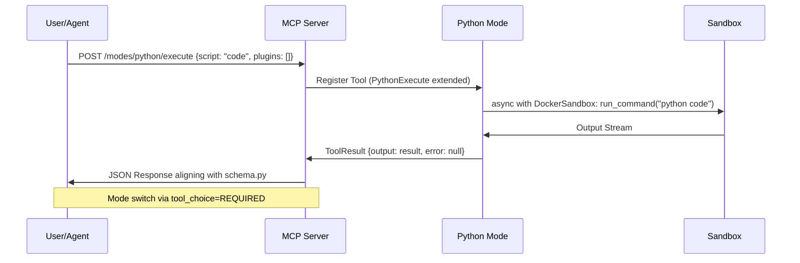
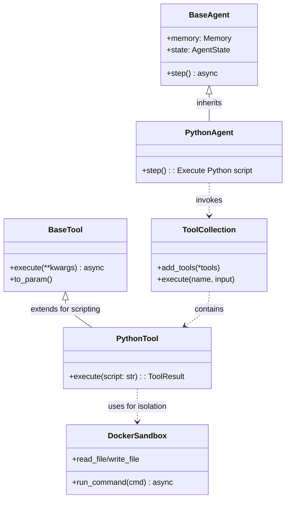

# Phase 1 Review: Integrating Python Mode into OpenManus Architecture

## Executive Summary
This review analyzes the existing OpenManus architecture to identify integration points for the new Python Mode, a lightweight scripting mode focused on extensibility via core Python runtime, modular plugins, security (sandboxing, validation), performance (async via asyncio), and use cases (API integrations, data processing). The analysis ensures backward compatibility and non-disruptive enhancements by leveraging existing components without introducing new browser libraries, relying instead on tools like [`browser_use_tool.py`](app/tool/browser_use_tool.py) and [`crawl4ai.py`](app/tool/crawl4ai.py).

Key findings:
- **Modular Task Handling**: Extend [`flow_factory.py`](app/flow/flow_factory.py) to register Python Mode as a new flow type.
- **Agentic Workflows**: Inherit from [`base.py`](app/agent/base.py) and integrate with [`manus.py`](app/agent/manus.py) via tool extensions.
- **Backend APIs**: Enhance [`server.py`](app/mcp/server.py) with mode-specific endpoints; extend [`python_execute.py`](app/tool/python_execute.py) for scripting.
- **Sandbox Isolation**: Utilize [`sandbox.py`](app/sandbox/core/sandbox.py) for secure execution.
- **Data Models & Prompts**: Extend [`schema.py`](app/schema.py) with Python-specific payloads; update prompts in [`app/prompt/`](app/prompt/) for mode awareness.
- **Configuration**: Add Python Mode sections to [`config.toml`](config/config.toml) and dependencies to [`requirements.txt`](requirements.txt) without conflicts.
- **Data Flows & Dependencies**: No major bottlenecks identified; flows remain async-compatible.
- **Recommendations**: Use existing hooks for minimal disruption.

Diagrams, API contracts, and detailed recommendations follow.

## 1. Review of Core Components

### 1.1 Modular Task Handling (app/flow/)
The flow system in [`base.py`](app/flow/base.py), [`flow_factory.py`](app/flow/flow_factory.py), and [`planning.py`](app/flow/planning.py) provides a flexible structure for orchestrating agents.

- **Integration Points**:
  - [`flow_factory.py`](app/flow/flow_factory.py): Add `FlowType.PYTHON = "python"` to the enum and register a `PythonFlow` class inheriting from `BaseFlow`. This allows creating Python Mode flows via `FlowFactory.create_flow(FlowType.PYTHON, agents)`.
  - [`planning.py`](app/flow/planning.py): Extend `PlanningFlow` to include Python-specific steps (e.g., `[PYTHON]` tagged steps) in plan creation. The LLM-driven planning can incorporate Python execution as a step type, using the `planning` tool to mark progress.
  - Dependencies: Relies on `BaseAgent` from [`app/agent/base.py`](app/agent/base.py); no bottlenecks, as flows are async and agent-agnostic.
  - Data Flow: Input → Plan Creation (LLM + PlanningTool) → Step Execution (via agents) → Status Updates. Python Mode can slot in as a specialized executor without altering the loop.

Potential Bottleneck: High step counts in complex plans; mitigate by limiting Python steps to async batches.

### 1.2 Agentic Workflows (app/agent/)
Agents like those in [`base.py`](app/agent/base.py), [`manus.py`](app/agent/manus.py), and [`toolcall.py`](app/agent/toolcall.py) form the core execution layer.

- **Integration Points**:
  - [`base.py`](app/agent/base.py): Python Mode agent (`PythonAgent`) inherits from `BaseAgent`, overriding `step()` to handle script execution via extended tools. Memory (`Memory` model) and state (`AgentState`) remain compatible.
  - [`manus.py`](app/agent/manus.py): Integrate as a tool in `available_tools` (e.g., add `PythonExecute` variant). MCP integration via `MCPClients` allows remote Python execution without local deps.
  - [`toolcall.py`](app/agent/toolcall.py): Extend `ToolCallAgent` for Python-specific tool choices (e.g., `ToolChoice.REQUIRED` for scripting steps). The `think()` → `act()` loop supports Python hooks seamlessly.
  - Other Agents (e.g., [`browser.py`](app/agent/browser.py), [`react.py`](app/agent/react.py)): Ensure compatibility by exposing Python Mode as a composable tool, avoiding direct inheritance to prevent tight coupling.
  - Dependencies: LLM (`app/llm.py`), tools (`ToolCollection`); async execution aligns with Python Mode's asyncio focus.
  - Data Flow: Messages (`Message` model) → Tool Calls → Execution → Results back to memory. Python scripts can generate `ToolResult` outputs.

No major bottlenecks; agent states prevent infinite loops.

### 1.3 Backend APIs (app/mcp/ and app/tool/)
APIs in [`server.py`](app/mcp/server.py) and tools like [`base.py`](app/tool/base.py), [`python_execute.py`](app/tool/python_execute.py) handle tool registration and execution.

- **Integration Points**:
  - [`server.py`](app/mcp/server.py): Extend `MCPServer` to register Python Mode tools dynamically (e.g., via `register_tool(PythonTool)`). Add mode-switching endpoints (see API Contracts below).
  - [`base.py`](app/tool/base.py): Python Mode tools inherit from `BaseTool`, using `ToolResult` for outputs (e.g., script results, errors).
  - [`python_execute.py`](app/tool/python_execute.py): Primary hook—extend for sandboxed, async Python execution with timeout (current: 5s multiprocessing). Add plugin support for modular extensions (e.g., API integrations).
  - Other Tools (e.g., [`browser_use_tool.py`](app/tool/browser_use_tool.py), [`crawl4ai.py`](app/tool/crawl4ai.py)): Python Mode can invoke these via imports, maintaining no new deps.
  - Dependencies: Pydantic for schemas; FastMCP for server.
  - Data Flow: Tool Param → Execute → JSON Result. Async via `asyncio` ensures performance.

Bottleneck: Synchronous multiprocessing in `python_execute.py`; recommend asyncio subprocess for better alignment.

### 1.4 Sandbox Isolation (app/sandbox/core/sandbox.py)
Provides Docker-based isolation for secure execution.

- **Integration Points**:
  - Use `DockerSandbox` for Python script runs: `async with DockerSandbox() as sb: await sb.run_command("python script.py")`.
  - Extend for Python-specific volumes (e.g., bind plugin dirs) and limits (CPU/memory from config).
  - Hooks: Integrate with `python_execute.py` to wrap exec in sandbox; supports file I/O via `read_file`/`write_file`.
  - Dependencies: Docker client; aligns with security goals.
  - Data Flow: Cmd → Container Exec → Stream Output. Async methods prevent blocking.

No bottlenecks; timeouts and resource limits already in place.

### 1.5 Data Models (app/schema.py) and Prompts (app/prompt/)
- **Data Models**:
  - Extend `Message` and `ToolCall` for Python payloads (e.g., add `script: str` field to `Function`).
  - `ToolResult` in [`base.py`](app/tool/base.py) supports Python outputs (e.g., `base64_image` for plots).
  - Compatibility: Pydantic v2 ensures non-breaking additions.

- **Prompts**:
  - [`planning.py`](app/prompt/planning.py): Update `PLANNING_SYSTEM_PROMPT` to include Python steps (e.g., "Use [PYTHON] for scripting").
  - [`manus.py`](app/prompt/manus.py): Enhance `SYSTEM_PROMPT` for Python tool awareness.
  - General: Add mode-specific system messages in agents.

Data Flow: Prompts → LLM → Structured Outputs. No issues.

### 1.6 Configuration (config/config.toml, requirements.txt)
- **`config.toml`**: Add `[python_mode]` section (e.g., `sandbox_image = "python:3.12-slim"`, `plugins = ["api", "data"]`). Extends existing `[llm]` and `[mcp]` without conflicts.
- **`requirements.txt`**: Add Python Mode deps (e.g., `asyncio-extra`, plugin libs like `requests` if needed), but reuse existing (e.g., `numpy` for data processing). No version conflicts anticipated.

## 2. Data Flows, Dependencies, and Bottlenecks
- **Overall Flow**: User Request → Flow Factory → Agent Orchestration (via MCP/Tools) → Sandbox Exec → Results (Schema-wrapped).
- **Dependencies Graph**:
  - Core: `BaseAgent` → `ToolCollection` → `BaseTool` → Sandbox.
  - Python Mode: Extends all without cycles.
- **Bottlenecks**:
  - Token limits in LLM calls (mitigate via concise prompts).
  - Sandbox startup time (~1-2s); cache images.
  - Async compatibility: All components support `asyncio`; ensure Python scripts are async-aware.
- **Backward Compatibility**: Use inheritance and optional fields; no breaking changes.

## 3. Architecture Diagrams (Mermaid)

### 3.1 Flowchart: Python Mode Integration into Existing Flows
```mermaid
flowchart TD
    A[User Request] --> B[Flow Factory create_flow]
    B --> C{ FlowType? }
    C -->|PLANNING| D[PlanningFlow: Create Plan with Steps]
    C -->|PYTHON| E[PythonFlow: Inherit BaseFlow + Async Script Exec]
    D --> F[Tag Steps e.g. [PYTHON]]
    E --> G[Extend PlanningFlow for Python Steps]
    F --> H[Agent Orchestration via BaseAgent]
    G --> H
    H --> I[ToolCallAgent: Invoke PythonExecute]
    I --> J[Sandbox: Docker Exec python script.py]
    J --> K[ToolResult Output]
    K --> L[Memory Update + Next Step]
    L --> M{Task Complete? }
    M -->|Yes| N[Finalize Plan]
    M -->|No| H
```

Highlights: Python Mode parallels existing flows, injecting at step execution.

### 3.2 Sequence Diagram: Mode Switching via MCP APIs


Highlights: Async sequence ensures non-blocking; uses existing MCP transport (stdio/SSE).

### 3.3 Component Diagram: Inheritance for Python Mode


Highlights: Loose coupling via composition; Python Mode reuses sandbox for security.

## 4. API Contracts

### 4.1 Mode Switching (in app/mcp/server.py)
- **Endpoint**: `POST /modes/python/execute`
  - **Request Payload** (JSON, aligns with schema.py `Function`):
    ```json
    {
      "mode": "python",
      "script": "print('Hello from Python Mode')",  // Required: Python code
      "plugins": ["api", "data"],  // Optional: Modular plugins
      "timeout": 30,  // Optional: Seconds, default 5
      "sandbox_config": {  // Optional: Extend sandbox.py
        "memory_limit": "512m",
        "cpu_limit": 1.0
      }
    }
    ```
  - **Response** (ToolResult model):
    ```json
    {
      "output": "Hello from Python Mode\n",  // Script stdout
      "error": null,  // Or error msg if failed
      "base64_image": null,  // For plots/visuals
      "system": "Sandbox cleaned up"  // Optional metadata
    }
    ```
  - **Auth/Validation**: Use existing FastMCP; validate via Pydantic.

- **Plugin Registration**: `POST /modes/python/register`
  - **Request**: `{ "plugin_name": "api", "code": "import requests..." }`
  - **Response**: `{ "status": "registered", "hook": "pre_execute" }`
  - Hooks: `pre_execute`, `post_execute` for extensibility.

### 4.2 Python Mode Interactions
- **Script Execution Hook**: Extend `python_execute.py` `execute()` to accept plugins, wrap in sandbox.
- **Async Support**: Return `asyncio.Future` for long-running scripts.
- **Error Handling**: Align with `ToolResult`; propagate via MCP.

## 5. Recommendations for Integration Hooks
- **Extend python_execute.py**: Add async subprocess (e.g., `asyncio.create_subprocess_exec("python", "-c", script)` ) for better performance. Integrate plugins as dynamic imports in sandbox.
- **Use Sandbox**: Mandatory for all executions; pre-load common libs (e.g., numpy from requirements.txt) in image to reduce startup.
- **Agent Compatibility**: In `manus.py` and others, add Python Mode to `available_tools` conditionally (via config). For `browser.py`, allow Python to process crawl4ai outputs (e.g., data extraction scripts).
- **Security/Validation**: Validate scripts (e.g., no `os.system` via ast parsing) before sandbox. Use asyncio for concurrent plugin execution.
- **Performance**: Batch Python steps in flows; monitor token usage in planning.
- **Testing**: Add to existing pytest suite; ensure no deps on new browser libs.
- **Backward Compatibility**: Version APIs (e.g., v1/python); optional fields in schemas.

This integration positions Python Mode as a seamless extension, enhancing scripting without disrupting core workflows.
