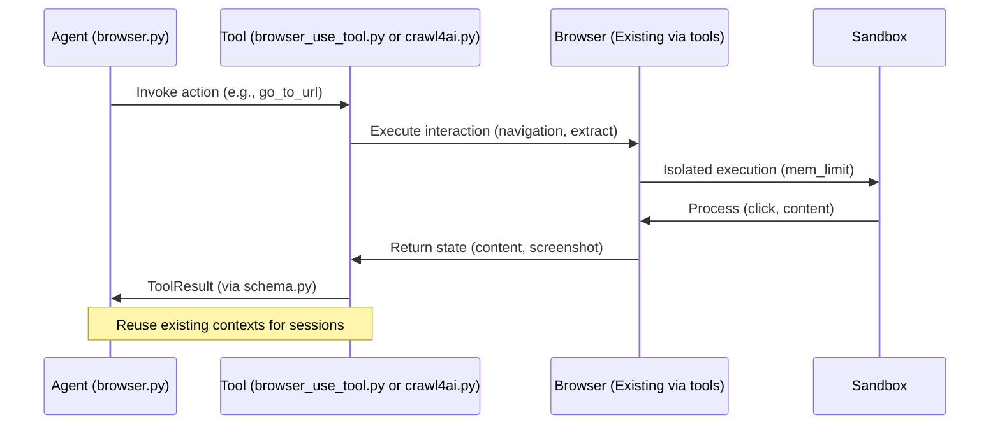
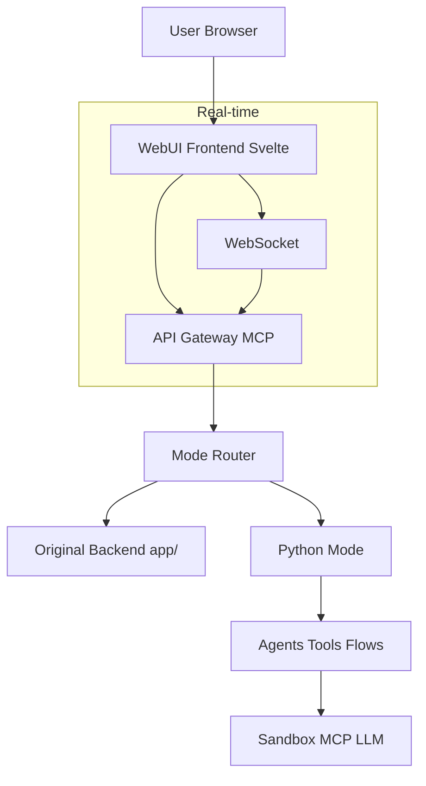
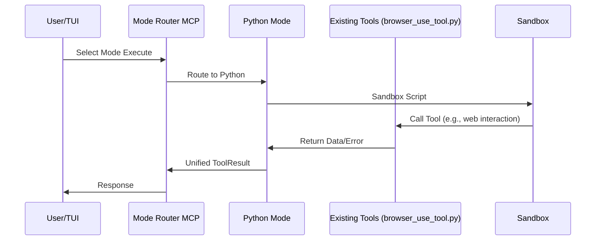

# OpenManus Architectural Roadmap

## Executive Summary
This refined roadmap builds on the foundational plan for enhancing OpenManus by introducing the "Python Mode" operational mode and a seamless WebUI, while ensuring deep integration with core paradigms like modular task handling in [`app/flow/`](app/flow/), agentic workflows in [`app/agent/`](app/agent/), and backend APIs via MCP in [`app/mcp/`](app/mcp/) and tools in [`app/tool/`](app/tool/). The architecture leverages existing Python components (agents like [`browser.py`](app/agent/browser.py) and [`manus.py`](app/agent/manus.py), tools like [`bash.py`](app/tool/bash.py) and [`python_execute.py`](app/tool/python_execute.py), flows in [`base.py`](app/flow/base.py), MCP server in [`server.py`](app/mcp/server.py), sandbox in [`sandbox.py`](app/sandbox/core/sandbox.py), and prompts), with TOML configuration ([`config.py`](app/config.py)) and dependencies in [`requirements.txt`](requirements.txt).

Prioritizing the Python Mode, this update expands its specifications for robust implementation, including a brief review of existing browser automation strategies. The roadmap maintains modularity, maintainability, and extensibility, with unified API endpoints to support both WebUI and programmatic modes without conflicts. Estimated timeline: 9-15 weeks across three phases, for a team of 2-3 developers. Resources: Python expertise, UI tools, cloud testing environments.

Key principles:
- **Modularity**: Pluggable modules aligning with existing agent/tool/flow structures.
- **Maintainability**: PEP 8 compliance, documentation, automated testing (>80% coverage).
- **Extensibility**: Dynamic plugin loading via importlib, compatible with MCP protocol.
- **Integration**: Leverage sandbox for isolation, extend schemas in [`schema.py`](app/schema.py) for error propagation.

## 1. Existing Browser Automation Review
A brief evaluation of existing browser automation usage across components (e.g., [`browser_use_tool.py`](app/tool/browser_use_tool.py) for general browser interactions, [`crawl4ai.py`](app/tool/crawl4ai.py) for AI-optimized crawling, and [`browser.py`](app/agent/browser.py) agent) confirms their suitability for web needs. These tools provide reliable DOM interactions, navigation, and extraction without introducing new complexities.

### Recommendations
Rely on existing implementations for all web interactions in the Python Mode:
- Use [`browser_use_tool.py`](app/tool/browser_use_tool.py) for scripted browser actions (e.g., navigation, clicking, extraction).
- Leverage [`crawl4ai.py`](app/tool/crawl4ai.py) for web crawling and content processing.
- Avoid new browser automation libraries; integrate via existing tool calls to maintain simplicity and compatibility.

### Alignment with Current Setup
- **Session Management**: Reuse persistent contexts from existing tools for stateful interactions (e.g., cookies, localStorage).
- **Resource Optimization**: Apply memory limits via sandbox Docker configs (mem_limit in [`sandbox.py`](app/sandbox/core/sandbox.py)), and timeouts. Monitor via logger in [`logger.py`](app/logger.py).
- **Proxy Configurations**: Integrate with config.toml [browser_config.proxy] for unified handling across tools.

This approach enhances reliability and performance by building on proven components, reducing maintenance overhead.

## 2. Support for Current Setup via WebUI
The WebUI provides an elegant interface for existing functionalities (agent orchestration, tool execution, flow management) without altering core Python logic. It communicates via unified APIs, ensuring compatibility with programmatic modes.

### Design Principles
- **Simplicity and Elegance**: Responsive layouts (Svelte/Solid.js/Qwik), themes, WCAG 2.1 accessibility.
- **Seamless Integration**: WebSocket for real-time (agent status, logs); REST APIs for mode switching and config.
- **Non-Disruptive**: CLI/TUI unchanged; WebUI optional layer.

### Key Features
- Dashboard: Active agents, flows, metrics.
- Mode Selector: Toggle original/Python Mode.
- Script Execution: Upload/run with feedback.
- Config Editor: TOML validation.
- Monitoring: Logs, alerts.

### Architecture Overview
Extend [`app/mcp/server.py`](app/mcp/server.py) for API gateway, unifying endpoints (e.g., /modes/{mode}/execute).

## 3. Specification for "Python Mode"
This mode enables lightweight, flexible Python scripting for broad extensibility, allowing users to perform tasks through scripted workflows that interact with APIs, local resources, or existing OpenManus tools (e.g., leveraging [`browser_use_tool.py`](app/tool/browser_use_tool.py) or [`crawl4ai.py`](app/tool/crawl4ai.py) for web needs). It builds on existing [`python_execute.py`](app/tool/python_execute.py) for script running, emphasizing core Python runtime without heavy browser automation.

### Core Components
- **Code Structure**: New directory [`app/modes/python_mode/`](app/modes/python_mode/):
  - `python_agent.py`: Inherits from [`base.py`](app/agent/base.py), orchestrates scripted workflows.
  - `python_tool.py`: Inherits from [`base.py`](app/tool/base.py), executes Python scripts as ToolResult.
  - `python_flow.py`: Mode-specific flows via [`flow_factory.py`](app/flow/flow_factory.py), e.g., sequential scripting tasks.
  - Plugins: `plugins/python_actions/` with classes like PythonAction (importlib dynamic loading) for custom actions.
- **Dependency Integration**: No new browser libraries; use existing [`requirements.txt`](requirements.txt). Install via setup.py; handle via pip in sandbox init ([`sandbox.py`](app/sandbox/core/sandbox.py)).
- **Error Handling Strategies**: Retry mechanisms with tenacity (e.g., @retry on API calls); propagate exceptions to [`schema.py`](app/schema.py) (extend Message/ToolCall with error fields like timeout, validation_error). Use try/except in tools, returning ToolResult(error=...).
- **Scalability Considerations**: Asyncio for concurrent execution (e.g., asyncio.gather multiple scripts); resource pooling via semaphores (limit concurrent runs to 5); handle high load with queueing in flows.
- **Integration Hooks**: Leverage sandbox ([`app/sandbox/`](app/sandbox/)) for isolation (Docker mem_limit=512m, network whitelisting); compatibility with existing agents like [`browser.py`](app/agent/browser.py) and [`manus.py`](app/agent/manus.py) via tool calls; extend flows in [`app/flow/`](app/flow/) and MCP in [`app/mcp/`](app/mcp/).

### Security Considerations
- Sandbox execution with file/network isolation via [`app/sandbox/`](app/sandbox/).
- Input validation and sanitization via pydantic in schemas.
- Audit logs for script actions.

### Performance Goals
- Minimal footprint with async support via asyncio.
- Compatibility with existing data models (Message, ToolCall) in [`schema.py`](app/schema.py).

### Use Cases
- API integrations and data processing.
- Automated testing without heavy browser control.
- Dynamic content generation.
- Local resource manipulation and scripted workflows.

### Integration Points
- Agents: Delegate to existing tools from python_agent.
- Tools: Extend [`python_execute.py`](app/tool/python_execute.py) for mode-specific scripting.
- Flows/MCP: Mode registration in factory/server.
- Prompts: Python-tuned in [`app/prompt/`](app/prompt/).

## 4. Unified API Endpoints for Mode Switching
To avoid conflicts, introduce a mode router in [`app/mcp/server.py`](app/mcp/server.py):
- Endpoints: POST /modes/{mode}/execute (body: script/config), GET /modes/status.
- Shared schemas: Extend [`schema.py`](app/schema.py) for mode-specific ToolCalls.
- WebUI/Programmatic: Same REST/WebSocket interface, routed via MCP.

## Roadmap Phases

### Phase 1: Python Mode Foundation (Weeks 1-4)
Focus: Prototype mode standalone with TUI integration and architecture review. Dependencies: None (baseline existing architecture).

#### Milestones
1. **Architecture Review (Week 1)**: Analyze integrations (e.g., sandbox extensions, schema updates); document reliance on existing tools.
2. **Python Mode Prototype (Weeks 2-3)**: Implement core in [`app/modes/python_mode/`](app/modes/python_mode/); add error/retry logic, TUI via Textual/Rich.
3. **Integration Testing (Week 4)**: Test with existing agents/tools; ensure compatibility.

#### Deliverables
- Updated diagrams (Mermaid sequences).
- API schemas (JSON for mode switching).
- Tests (pytest >80% coverage).
- POC script/video with TUI demo.

#### Risks/Mitigations
- Integration conflicts: Use mocks.
- Performance: Benchmark async scripting.
- Resources: 1 Python dev, Docker env.

### Phase 2: WebUI and API Unification (Weeks 5-9)
Focus: Build WebUI, unify with modes. Dependencies: Phase 1 prototypes.

#### Milestones
1. **API Extensions (Week 5)**: Add mode endpoints in MCP.
2. **Frontend Build (Weeks 6-7)**: Svelte components (dashboard, selector).
3. **Integration (Weeks 8)**: Connect WebUI to modes; add auth/error handling ([`exceptions.py`](app/exceptions.py)).
4. **Testing (Week 9)**: E2E tests for unified flows.

#### Deliverables
- UI prototypes (Figma/live).
- Full-stack code.
- Deployment docs (Docker/K8s).

#### Risks/Mitigations
- Framework issues: Fallback to Solid.js.
- Scaling: Resource pooling.
- Resources: 1 full-stack, DevOps.

### Phase 3: Optimization and Full Deployment (Weeks 10-13)
Focus: Polish, scale, deploy. Dependencies: Phases 1-2 outputs.

#### Milestones
1. **Optimization (Week 10)**: Tune resources (async, limits); review existing tool integrations.
2. **Full Testing (Week 11)**: Load/security tests; validate mode compatibility.
3. **Deployment (Weeks 12-13)**: Dockerize, CI/CD; docs for modes.

#### Deliverables
- Performance benchmarks.
- Audit reports.
- Release guidelines.

#### Risks/Mitigations
- Bottlenecks: Async queuing.
- Timeline: Iterative testing.

#### Resources
- 1-2 devs, CI tools.

## Overall Risk Assessment
- High: Security (audit phased).
- Medium: Delays (mocks/testing).
- Low: UI (frameworks).

## Next Steps
Review/approve this refined roadmap. Switch to Code mode for Phase 1.
