# Monetization-Focused Web Automation Tools for OpenManus

## Executive Summary

This document proposes **8 specialized tools** designed for rapid revenue generation (7-14 days to first dollar) through web-based monetization activities. These tools leverage OpenManus's existing [`BrowserUseTool`](app/tool/browser_use_tool.py:39), [`WebSearch`](app/tool/web_search.py:156), and [`Crawl4aiTool`](app/tool/crawl4ai.py:16) capabilities to enable autonomous or semi-autonomous income generation with low barriers to entry.

**Focus:** Arbitrage, data collection services, and marketplace automation
**Timeline:** 7-14 days to first revenue
**Risk Level:** Low to medium (ethical, legal compliance prioritized)

---

## Current Web Automation Capabilities

### Existing Foundation
- **[`BrowserUseTool`](app/tool/browser_use_tool.py:39)**: Full browser automation (navigation, clicking, form filling, content extraction, tab management)
- **[`WebSearch`](app/tool/web_search.py:156)**: Multi-engine search (Google, Bing, DuckDuckGo, Baidu) with content fetching
- **[`Crawl4aiTool`](app/tool/crawl4ai.py:16)**: High-performance web scraping with clean markdown extraction

### Key Capabilities to Leverage
- Automated form filling and submission
- Multi-page navigation and session management
- Content extraction with AI-powered analysis
- Screenshot capture and visual data collection
- JavaScript-heavy site handling
- Proxy support and anti-detection features

---

## Proposed Monetization Tools

### 💰 **1. MarketplaceArbitrageTool**

**Revenue Model:** Buy low on one platform, sell high on another (product arbitrage)

**Description:**
Automated product research and arbitrage opportunity detection across multiple e-commerce platforms (Amazon, eBay, Walmart, AliExpress, etc.). Identifies price discrepancies and calculates profit margins after fees and shipping.

**Key Capabilities:**
- **Multi-platform price monitoring**: Track product prices across 5+ marketplaces simultaneously
- **Profit calculation engine**: Automatic ROI calculation including platform fees, shipping, taxes
- **Trend analysis**: Historical price tracking and demand forecasting
- **Listing automation**: Auto-generate optimized product listings for target platforms
- **Inventory sync**: Track sold items and update listings across platforms
- **Competition monitoring**: Track competitor pricing and adjust strategies

**Technical Implementation:**
```python
{
    "action": "find_arbitrage_opportunities" | "monitor_prices" | "create_listing" | "sync_inventory",
    "source_platforms": ["amazon", "aliexpress", "walmart"],
    "target_platforms": ["ebay", "facebook_marketplace", "mercari"],
    "product_categories": List[str],
    "min_profit_margin": float,  # e.g., 0.25 for 25%
    "max_price_point": float,
    "filters": {
        "min_rating": float,
        "shipping_time_max": int,
        "brand_whitelist": List[str]
    }
}
```

**Revenue Potential:**
- **First Dollar:** 3-7 days (list and sell first arbitrage product)
- **Monthly Target:** $500-$2,000 (10-20 transactions at $50-100 profit each)
- **Scaling:** $5,000-$15,000/month with inventory expansion

**Integration with Existing Tools:**
- Uses [`BrowserUseTool`](app/tool/browser_use_tool.py:39) for marketplace navigation and listing creation
- Leverages [`WebSearch`](app/tool/web_search.py:156) for product research
- Uses [`Crawl4aiTool`](app/tool/crawl4ai.py:16) for bulk product data extraction

**Compliance:**
- Respects marketplace ToS
- No unauthorized scraping of protected data
- Proper seller account registration required
- Tax compliance tracking

---

### 📊 **2. DataCollectionServiceTool**

**Revenue Model:** Sell structured data to businesses (lead generation, market research, price intelligence)

**Description:**
Provides data-as-a-service by collecting, cleaning, and packaging web data for B2B clients. Targets businesses needing competitive intelligence, lead lists, pricing data, or market research.

**Key Capabilities:**
- **Custom data extraction**: Configure scraping rules for any website
- **Data cleaning & enrichment**: AI-powered data validation and enhancement
- **Export formats**: CSV, JSON, API endpoints, database integration
- **Scheduling**: Automated recurring data collection
- **Quality assurance**: Duplicate detection, validation rules, error handling
- **API delivery**: RESTful API for client data access

**Technical Implementation:**
```python
{
    "service_type": "lead_generation" | "price_monitoring" | "market_research" | "contact_scraping",
    "target_sources": List[str],  # URLs or domains
    "data_schema": {
        "fields": List[dict],  # Define required fields
        "validation_rules": dict,
        "enrichment_rules": dict
    },
    "collection_frequency": "hourly" | "daily" | "weekly" | "on_demand",
    "delivery_method": "api" | "email" | "database" | "file_export",
    "client_config": {
        "api_key": str,
        "webhook_url": str,
        "notification_preferences": dict
    }
}
```

**Revenue Potential:**
- **First Dollar:** 5-10 days (first client project)
- **Pricing Models:**
  - One-time datasets: $100-$1,000 per project
  - Recurring data subscriptions: $200-$2,000/month per client
  - API access: $500-$5,000/month based on volume
- **Monthly Target:** $1,000-$5,000 (3-5 clients)
- **Scaling:** $10,000-$50,000/month with 20-30 enterprise clients

**Service Examples:**
- **Lead Generation**: Email lists of decision-makers in specific industries ($500-$2,000/list)
- **Price Intelligence**: Daily competitor pricing for e-commerce ($300-$1,500/month)
- **Real Estate Data**: Property listings, valuations, market trends ($1,000-$5,000/month)
- **Job Market Data**: Salary trends, skills demand, hiring patterns ($500-$2,000/project)

**Integration with Existing Tools:**
- Primary engine: [`Crawl4aiTool`](app/tool/crawl4ai.py:16) for efficient bulk data extraction
- Uses [`BrowserUseTool`](app/tool/browser_use_tool.py:39) for JavaScript-heavy sites
- Leverages [`WebSearch`](app/tool/web_search.py:156) for discovery

**Compliance:**
- Respects robots.txt and ToS
- No personal data scraping without consent
- GDPR/CCPA compliance for data handling
- Rate limiting to avoid server overload

---

### 🎯 **3. LeadGenerationEngineTool**

**Revenue Model:** Generate and sell qualified leads to businesses (CPL - Cost Per Lead)

**Description:**
Automated lead discovery, qualification, and enrichment system. Finds potential customers for B2B services through web research, extracts contact information, validates data quality, and delivers qualified leads.

**Key Capabilities:**
- **Prospect discovery**: Identify companies/individuals matching target criteria
- **Contact enrichment**: Find email addresses, phone numbers, LinkedIn profiles
- **Lead scoring**: AI-powered qualification based on multiple signals
- **Email validation**: Verify deliverability before sale
- **CRM integration**: Export to Salesforce, HubSpot, or custom systems
- **Compliance tracking**: Ensure opt-in/opt-out preferences

**Technical Implementation:**
```python
{
    "action": "discover_leads" | "enrich_contacts" | "validate_leads" | "export_leads",
    "target_criteria": {
        "industry": List[str],
        "company_size": str,  # "1-10", "11-50", "51-200", etc.
        "location": List[str],
        "job_titles": List[str],
        "technologies_used": List[str],
        "revenue_range": tuple
    },
    "enrichment_sources": ["linkedin", "company_websites", "directories", "public_databases"],
    "validation_requirements": {
        "email_verification": bool,
        "phone_verification": bool,
        "company_verification": bool
    },
    "lead_scoring_model": {
        "signals": List[str],  # e.g., "has_funding", "growing_team", "tech_stack_match"
        "weights": dict
    },
    "output_format": "csv" | "json" | "crm_api"
}
```

**Revenue Potential:**
- **First Dollar:** 7-14 days (first lead package sale)
- **Pricing Models:**
  - Qualified leads: $5-$50 per lead (B2B)
  - Lead packages: $500-$2,000 for 50-100 leads
  - Monthly subscriptions: $1,000-$5,000/month for recurring lead delivery
- **Monthly Target:** $2,000-$8,000 (5-10 clients)
- **Scaling:** $20,000-$100,000/month with specialization and volume

**Target Markets:**
- **SaaS companies**: Need qualified trial signups ($10-$30/lead)
- **B2B services**: Consulting, agencies, professional services ($20-$50/lead)
- **Real estate**: Investor leads, FSBO contacts ($5-$15/lead)
- **Recruiting**: Passive candidate sourcing ($15-$40/lead)

**Integration with Existing Tools:**
- Uses [`WebSearch`](app/tool/web_search.py:156) for company discovery
- Leverages [`Crawl4aiTool`](app/tool/crawl4ai.py:16) for contact extraction
- Uses [`BrowserUseTool`](app/tool/browser_use_tool.py:39) for LinkedIn research

**Compliance:**
- CAN-SPAM Act compliance
- GDPR right to erasure support
- Opt-out mechanism included
- No illegal contact harvesting

---

### 🤖 **4. ContentMonetizationTool**

**Revenue Model:** Automated content creation and monetization (ads, affiliate, sponsored)

**Description:**
Creates, optimizes, and publishes web content designed for passive income generation through ads, affiliate marketing, or sponsored content. Automates the entire content marketing workflow from research to publication.

**Key Capabilities:**
- **Keyword research**: Find high-value, low-competition keywords
- **Content generation**: AI-powered article creation with SEO optimization
- **Multi-platform publishing**: Auto-publish to WordPress, Medium, Blogger, etc.
- **Affiliate link insertion**: Automatic affiliate product recommendations
- **Performance tracking**: Monitor traffic, clicks, conversions
- **A/B testing**: Test headlines, CTAs, content formats

**Technical Implementation:**
```python
{
    "action": "research_keywords" | "generate_content" | "optimize_seo" | "publish_content" | "monitor_performance",
    "content_strategy": {
        "niche": str,  # e.g., "tech reviews", "finance tips", "health"
        "content_types": ["article", "listicle", "review", "tutorial"],
        "target_keyword_volume": tuple,  # (min, max) monthly searches
        "competition_level": "low" | "medium" | "high"
    },
    "monetization_methods": {
        "affiliate_programs": List[str],  # Amazon, ShareASale, CJ, etc.
        "ad_networks": List[str],  # AdSense, Mediavine, Ezoic
        "sponsored_content": bool
    },
    "publishing_targets": List[dict],  # WordPress sites, Medium, etc.
    "seo_optimization": {
        "target_keywords": List[str],
        "internal_linking": bool,
        "image_optimization": bool,
        "meta_tags": bool
    },
    "content_quality": {
        "min_word_count": int,
        "readability_score": str,  # "easy", "medium", "advanced"
        "uniqueness_threshold": float  # 0.95 = 95% unique
    }
}
```

**Revenue Potential:**
- **First Dollar:** 30-60 days (SEO takes time, but faster with Medium Partner)
- **Monthly Revenue (per site):**
  - Ad revenue: $100-$1,000/month (1,000-10,000 pageviews)
  - Affiliate commissions: $200-$2,000/month (depending on niche)
  - Sponsored posts: $100-$500/post (1-4 posts/month)
- **Scaling:** $5,000-$20,000/month with 10+ content properties

**Fast Revenue Strategies:**
- **Medium Partner Program**: Faster monetization (days vs months)
- **High-intent affiliate content**: Product reviews, comparisons
- **Trending topics**: Capitalize on current events for immediate traffic

**Integration with Existing Tools:**
- Uses [`WebSearch`](app/tool/web_search.py:156) for keyword and trend research
- Leverages [`Crawl4aiTool`](app/tool/crawl4ai.py:16) for competitor analysis
- Uses [`BrowserUseTool`](app/tool/browser_use_tool.py:39) for CMS publishing
- Integrates with [`CreateChatCompletion`](app/tool/create_chat_completion.py:1) for content generation

**Compliance:**
- FTC affiliate disclosure requirements
- Ad network ToS compliance
- Original content (no plagiarism)
- Copyright respect

---

### 🛍️ **5. DropshippingAutomationTool**

**Revenue Model:** Automated dropshipping operations (product sourcing, listing, order fulfillment)

**Description:**
End-to-end dropshipping automation that handles product discovery, supplier management, listing optimization, order processing, and customer service. Focuses on high-margin, trending products with reliable suppliers.

**Key Capabilities:**
- **Product research**: Find winning products with trend analysis
- **Supplier vetting**: Verify supplier reliability and shipping times
- **Multi-store management**: Manage Shopify, WooCommerce, eBay stores
- **Dynamic pricing**: Automated pricing based on competition and margins
- **Order fulfillment**: Auto-forward orders to suppliers
- **Inventory sync**: Real-time stock level updates
- **Customer service automation**: Handle common inquiries

**Technical Implementation:**
```python
{
    "action": "find_products" | "vet_supplier" | "create_listing" | "process_order" | "update_inventory",
    "product_criteria": {
        "categories": List[str],
        "price_range": tuple,
        "min_margin": float,  # e.g., 0.30 for 30% margin
        "shipping_time_max": int,  # days
        "trend_score_min": float  # 0-1 scale
    },
    "supplier_sources": ["aliexpress", "alibaba", "cjdropshipping", "spocket"],
    "store_platforms": List[dict],  # Store credentials and configs
    "pricing_strategy": {
        "markup_percentage": float,
        "competitive_pricing": bool,
        "psychological_pricing": bool  # e.g., $19.99 instead of $20
    },
    "fulfillment_automation": {
        "auto_order": bool,
        "tracking_updates": bool,
        "supplier_preference_order": List[str]
    }
}
```

**Revenue Potential:**
- **First Dollar:** 7-14 days (launch store, first sale)
- **Per Product Margin:** 30-50% typical
- **Monthly Target:** $2,000-$5,000 revenue ($600-$2,500 profit at 30-50% margin)
- **Scaling:** $10,000-$50,000/month with product diversification and paid ads

**Fast Launch Strategy:**
- Use proven winning products (reduce research time)
- Start with 10-20 high-potential products
- Focus on impulse-buy items ($20-$50 price range)
- Leverage social proof (reviews, testimonials)

**Integration with Existing Tools:**
- Uses [`BrowserUseTool`](app/tool/browser_use_tool.py:39) for supplier site navigation
- Leverages [`WebSearch`](app/tool/web_search.py:156) for product research
- Uses [`Crawl4aiTool`](app/tool/crawl4ai.py:16) for competitor analysis

**Compliance:**
- Consumer protection laws
- Accurate product descriptions
- Clear shipping time disclosures
- Return policy implementation

---

### 📈 **6. PriceMonitoringServiceTool**

**Revenue Model:** Competitive intelligence as a service (subscriptions from e-commerce businesses)

**Description:**
Automated price tracking and competitive intelligence for e-commerce businesses. Monitors competitor pricing, stock levels, promotions, and provides actionable insights for pricing strategy optimization.

**Key Capabilities:**
- **Real-time price tracking**: Monitor 100s of competitor products hourly
- **Stock level monitoring**: Alert on competitor out-of-stock situations
- **Promotion detection**: Identify sales, coupons, bundle deals
- **Price history analytics**: Trend analysis and forecasting
- **Automated repricing**: Suggest or auto-implement price changes
- **Competitor mapping**: Identify who's competing for your products
- **Alert system**: Instant notifications on significant price changes

**Technical Implementation:**
```python
{
    "action": "track_prices" | "analyze_trends" | "detect_promotions" | "recommend_pricing" | "auto_reprice",
    "monitoring_config": {
        "products": List[dict],  # Product identifiers and URLs
        "competitors": List[str],  # Competitor domains
        "frequency": "hourly" | "daily" | "custom",
        "platforms": ["amazon", "walmart", "bestbuy", "target"]
    },
    "analysis_features": {
        "price_elasticity": bool,
        "demand_forecasting": bool,
        "seasonal_trends": bool,
        "competitor_strategy_detection": bool
    },
    "repricing_rules": {
        "strategy": "match_lowest" | "beat_by_percentage" | "maintain_margin" | "custom",
        "min_margin": float,
        "max_discount": float,
        "auto_apply": bool  # or suggest only
    },
    "alerts": {
        "price_drop_threshold": float,  # e.g., 0.10 for 10% drop
        "out_of_stock_alerts": bool,
        "new_competitor_alerts": bool
    }
}
```

**Revenue Potential:**
- **First Dollar:** 5-10 days (first client onboarding)
- **Pricing Models:**
  - Starter: $100-$300/month (up to 50 products)
  - Professional: $300-$800/month (up to 200 products)
  - Enterprise: $800-$3,000/month (unlimited products + custom features)
- **Monthly Target:** $1,500-$5,000 (10-15 clients)
- **Scaling:** $15,000-$50,000/month with 50+ clients

**Target Markets:**
- **Small e-commerce brands**: Need competitive intelligence ($100-$300/month)
- **Amazon sellers**: Dynamic repricing critical ($200-$500/month)
- **Retailers**: Multi-channel price optimization ($500-$2,000/month)
- **Brands with MAP policies**: Monitor unauthorized sellers ($300-$1,000/month)

**Integration with Existing Tools:**
- Primary engine: [`Crawl4aiTool`](app/tool/crawl4ai.py:16) for efficient price extraction
- Uses [`BrowserUseTool`](app/tool/browser_use_tool.py:39) for JavaScript-rendered prices
- Uses [`WebSearch`](app/tool/web_search.py:156) for competitor discovery

**Compliance:**
- Respects robots.txt and ToS
- Rate limiting to avoid overload
- No credential theft or unauthorized access
- Data protection for client info

---

### 🌐 **7. WebsiteFlippingTool**

**Revenue Model:** Build and sell content websites (capital gains from domain/site sales)

**Description:**
Automates the process of building monetizable websites from scratch, growing traffic and revenue, then selling them for profit. Handles domain research, content creation, SEO, monetization setup, and even buyer prospecting.

**Key Capabilities:**
- **Domain research**: Find brandable, SEO-friendly domains
- **Niche validation**: Analyze niche profitability and competition
- **Site setup automation**: WordPress installation, theme setup, plugins
- **Content pipeline**: Auto-generate and publish SEO content
- **Monetization setup**: Configure ads, affiliates, email capture
- **Traffic generation**: Basic SEO and content marketing
- **Valuation**: Calculate site worth based on traffic/revenue
- **Buyer prospecting**: Find potential buyers on Flippa, Empire Flippers

**Technical Implementation:**
```python
{
    "action": "research_niche" | "setup_site" | "generate_content" | "build_backlinks" | "monetize" | "value_site" | "list_for_sale",
    "niche_criteria": {
        "categories": List[str],
        "competition_level": "low" | "medium",
        "monetization_potential": "high" | "medium",
        "evergreen_content": bool
    },
    "site_setup": {
        "domain_name": str,
        "hosting_platform": str,
        "cms": "wordpress" | "ghost" | "custom",
        "theme": str,
        "essential_plugins": List[str]
    },
    "content_strategy": {
        "articles_count": int,  # e.g., 20-50 articles
        "publishing_schedule": str,
        "content_quality": "high" | "medium",
        "keyword_targeting": List[str]
    },
    "monetization_setup": {
        "ad_network": str,  # AdSense, etc.
        "affiliate_programs": List[str],
        "email_marketing": bool
    },
    "growth_metrics": {
        "target_monthly_pageviews": int,
        "target_monthly_revenue": float,
        "build_duration_months": int  # 3-6 typical
    }
}
```

**Revenue Potential:**
- **First Dollar:** 90-180 days (build → monetize → sell)
- **Site Valuation:** Typically 20-40x monthly profit
  - $100/month profit = $2,000-$4,000 sale price
  - $500/month profit = $10,000-$20,000 sale price
  - $1,000/month profit = $20,000-$40,000 sale price
- **Per-Site ROI:** $1,000-$5,000 profit per flip (after costs)
- **Portfolio Strategy:** Build 3-5 sites simultaneously

**Fast Flip Strategy:**
- Focus on proven niches (finance, health, tech)
- Use AI content to accelerate publishing
- Target 50-100 articles per site
- Aim for $100-$500/month revenue before sale
- Sell on Flippa (faster, lower prices) vs Empire Flippers (slower, premium prices)

**Integration with Existing Tools:**
- Uses [`WebSearch`](app/tool/web_search.py:156) for niche research
- Leverages [`Crawl4aiTool`](app/tool/crawl4ai.py:16) for competitor analysis
- Uses [`BrowserUseTool`](app/tool/browser_use_tool.py:39) for site setup and marketplace listing
- Integrates with [`CreateChatCompletion`](app/tool/create_chat_completion.py:1) for content generation

**Compliance:**
- Original content (no scraped content)
- Legitimate traffic (no fake traffic)
- Accurate revenue disclosure
- Clear site ownership transfer

---

### 🔍 **8. SocialMediaArbitrageTool**

**Revenue Model:** Buy social media engagement/traffic cheap, resell at premium (or monetize directly)

**Description:**
Identifies undervalued social media content, accounts, or products, then amplifies reach through strategic engagement, cross-posting, or paid promotion for quick monetization through brand deals, affiliate commissions, or account flipping.

**Key Capabilities:**
- **Viral content detection**: Find trending content before it peaks
- **Cross-platform distribution**: Auto-repost to TikTok, Instagram, YouTube Shorts, Twitter
- **Engagement automation**: Strategic likes, comments, follows (within ToS)
- **Influencer arbitrage**: Find underpriced influencer collaborations
- **Brand deal prospecting**: Identify brands seeking influencers
- **Account growth**: Automated content strategy and posting
- **Analytics tracking**: Monitor growth, engagement, conversions

**Technical Implementation:**
```python
{
    "action": "find_viral_content" | "cross_post" | "grow_account" | "find_brand_deals" | "monetize",
    "content_discovery": {
        "platforms": ["tiktok", "instagram", "youtube", "twitter"],
        "categories": List[str],  # e.g., "comedy", "finance", "tech"
        "virality_indicators": {
            "engagement_rate_min": float,
            "growth_velocity_min": float,
            "view_count_min": int
        }
    },
    "distribution_strategy": {
        "target_platforms": List[str],
        "content_adaptations": dict,  # Platform-specific edits
        "posting_schedule": dict,
        "hashtag_strategy": dict
    },
    "growth_tactics": {
        "engagement_automation": bool,  # Within ToS limits
        "collaboration_outreach": bool,
        "trending_topic_participation": bool,
        "paid_promotion_budget": float
    },
    "monetization_methods": {
        "brand_partnerships": bool,
        "affiliate_marketing": bool,
        "digital_products": bool,
        "account_flipping": bool
    }
}
```

**Revenue Potential:**
- **First Dollar:** 7-30 days (depending on monetization method)
- **Revenue Streams:**
  - Brand deals: $100-$2,000 per post (5K-100K followers)
  - Affiliate commissions: $200-$2,000/month per account
  - Account sales: $500-$10,000 per established account
  - Digital products: $100-$1,000/month per account
- **Monthly Target:** $1,000-$5,000 (multiple accounts/streams)
- **Scaling:** $10,000-$50,000/month with agency model

**Fast Money Tactics:**
- **TikTok Creator Fund**: Monetize viral videos quickly
- **Instagram Reels Bonus**: Cash bonuses for views
- **YouTube Shorts Fund**: Pay for short-form content
- **Affiliate partnerships**: Immediate commissions on sales

**Integration with Existing Tools:**
- Uses [`WebSearch`](app/tool/web_search.py:156) for trend discovery
- Leverages [`Crawl4aiTool`](app/tool/crawl4ai.py:16) for content scraping (ethically)
- Uses [`BrowserUseTool`](app/tool/browser_use_tool.py:39) for platform automation
- Integrates with [`CreateChatCompletion`](app/tool/create_chat_completion.py:1) for captions/scripts

**Compliance:**
- Respect platform ToS (no bots that violate rules)
- Disclose sponsored content (FTC compliance)
- Respect copyright (fair use, licensing)
- Authentic engagement (no fake followers/likes for client accounts)

---

## Prioritization Matrix: Speed to Revenue

| Tool | First $ | Monthly Revenue (Start) | Monthly Revenue (Scale) | Effort Level | Risk Level | Priority |
|------|---------|-------------------------|-------------------------|--------------|------------|----------|
| **MarketplaceArbitrageTool** | 3-7 days | $500-$2,000 | $5,000-$15,000 | Medium | Low | **P0** |
| **DataCollectionServiceTool** | 5-10 days | $1,000-$5,000 | $10,000-$50,000 | Medium | Low | **P0** |
| **LeadGenerationEngineTool** | 7-14 days | $2,000-$8,000 | $20,000-$100,000 | Medium | Low | **P0** |
| **PriceMonitoringServiceTool** | 5-10 days | $1,500-$5,000 | $15,000-$50,000 | Low | Low | **P1** |
| **DropshippingAutomationTool** | 7-14 days | $600-$2,500 | $3,000-$15,000 | High | Medium | **P1** |
| **SocialMediaArbitrageTool** | 7-30 days | $1,000-$5,000 | $10,000-$50,000 | Medium | Medium | **P2** |
| **ContentMonetizationTool** | 30-60 days | $300-$3,000 | $5,000-$20,000 | Medium | Low | **P2** |
| **WebsiteFlippingTool** | 90-180 days | $1,000-$5,000 | $3,000-$15,000 | High | Low | **P3** |

### Priority Rankings Explained

**P0 (Implement First):**
- Fastest path to revenue (3-14 days)
- Low barrier to entry
- Proven business models
- Minimal legal/ethical risk

**P1 (Implement Second):**
- Fast revenue (5-14 days)
- Moderate complexity
- Strong scaling potential
- Clear market demand

**P2 (Implement Third):**
- Moderate timeline (7-60 days)
- Higher setup complexity or moderate risk
- Good scaling potential
- Platform dependency risks

**P3 (Nice to Have):**
- Longer timeline (90+ days)
- High effort/complexity
- Good ROI but delayed gratification

---

## Recommended Implementation Sequence

### Phase 1: Quick Wins (Weeks 1-2)
1. **MarketplaceArbitrageTool** - Fastest revenue, proven model
2. **DataCollectionServiceTool** - B2B service, recurring revenue
3. **LeadGenerationEngineTool** - High margins, scalable

**Expected Phase 1 Revenue:** $1,500-$5,000 (first month)

### Phase 2: Scale Operations (Weeks 3-4)
4. **PriceMonitoringServiceTool** - SaaS model, low maintenance
5. **DropshippingAutomationTool** - Higher volume, automation focus

**Expected Phase 2 Revenue:** $3,000-$10,000/month (month 2)

### Phase 3: Diversification (Weeks 5-8)
6. **SocialMediaArbitrageTool** - Different revenue stream
7. **ContentMonetizationTool** - Passive income potential

**Expected Phase 3 Revenue:** $5,000-$20,000/month (month 3-4)

### Phase 4: Long-term Value (Weeks 9-16)
8. **WebsiteFlippingTool** - Capital gains focus

---

## Technical Architecture

### Shared Components

All tools extend the OpenManus tool infrastructure:

```python
from app.tool.base import BaseTool, ToolResult
from app.tool.browser_use_tool import BrowserUseTool
from app.tool.web_search import WebSearch
from app.tool.crawl4ai import Crawl4aiTool

class MonetizationBaseTool(BaseTool):
    """Base class for all monetization tools"""

    browser_tool: BrowserUseTool = Field(default_factory=BrowserUseTool)
    search_tool: WebSearch = Field(default_factory=WebSearch)
    crawl_tool: Crawl4aiTool = Field(default_factory=Crawl4aiTool)

    async def execute(self, **kwargs) -> ToolResult:
        """Each tool implements its own execute method"""
        pass
```

### Integration Points

```mermaid
graph TB
    subgraph Monetization Tools Layer
        MAT[MarketplaceArbitrageTool]
        DCST[DataCollectionServiceTool]
        LGET[LeadGenerationEngineTool]
        CMT[ContentMonetizationTool]
        DAT[DropshippingAutomationTool]
        PMST[PriceMonitoringServiceTool]
        WFT[WebsiteFlippingTool]
        SMAT[SocialMediaArbitrageTool]
    end

    subgraph Core Web Tools
        BU[BrowserUseTool]
        WS[WebSearch]
        C4[Crawl4aiTool]
    end

    subgraph AI Tools
        CCT[CreateChatCompletion]
        ES[EmbeddingsSearch]
    end

    subgraph Support Tools
        SQL[SQLTools]
        PT[PlanningTool]
    end

    MAT --> BU & WS & C4
    DCST --> C4 & BU & WS
    LGET --> WS & C4 & BU
    CMT --> WS & C4 & BU & CCT
    DAT --> BU & WS & C4
    PMST --> C4 & BU
    WFT --> BU & WS & C4 & CCT
    SMAT --> WS & C4 & BU & CCT

    MAT & DCST & LGET & CMT & DAT & PMST & WFT & SMAT --> SQL
    MAT & DCST & LGET & CMT & DAT & PMST & WFT & SMAT --> PT
```



---

## Implementation Checklist

### For Each Tool

- [ ] **Core Functionality**
  - [ ] Define parameter schema
  - [ ] Implement execute() method
  - [ ] Error handling and retry logic
  - [ ] Rate limiting and throttling

- [ ] **Data Management**
  - [ ] Database schema design (if needed)
  - [ ] Data persistence layer
  - [ ] Export/API functionality
  - [ ] Backup and recovery

- [ ] **Compliance & Ethics**
  - [ ] ToS compliance validation
  - [ ] Rate limiting implementation
  - [ ] User consent mechanisms
  - [ ] Data privacy safeguards

- [ ] **Testing**
  - [ ] Unit tests
  - [ ] Integration tests
  - [ ] Performance benchmarks
  - [ ] Error scenario testing

- [ ] **Documentation**
  - [ ] API documentation
  - [ ] Usage examples
  - [ ] Revenue model documentation
  - [ ] Compliance guidelines

---

## Dependencies & Infrastructure

### Python Dependencies
```python
# Add to requirements.txt
playwright>=1.40.0          # BrowserUseTool dependency
crawl4ai>=0.3.0            # Crawl4aiTool dependency
beautifulsoup4>=4.12.0     # HTML parsing
pandas>=2.1.0              # Data manipulation
sqlalchemy>=2.0.0          # Database ORM
redis>=5.0.0               # Caching layer
celery>=5.3.0              # Task queue for scheduling
stripe>=7.0.0              # Payment processing (for SaaS tools)
sendgrid>=6.11.0           # Email notifications
pydantic>=2.5.0            # Data validation
```

### Infrastructure Requirements
- **Database**: PostgreSQL or SQLite for data storage
- **Cache**: Redis for session management and rate limiting
- **Task Queue**: Celery for scheduled tasks
- **API Layer**: FastAPI for external integrations
- **Monitoring**: Prometheus + Grafana for metrics
- **Storage**: S3-compatible for data exports

---

## Risk Mitigation

### Legal & Ethical Risks
- **Platform ToS Violations**: Implement ToS compliance checks before execution
- **Data Privacy**: GDPR/CCPA compliance, data minimization
- **Copyright**: Respect content ownership, fair use guidelines
- **Fraud Prevention**: Validate authenticity, no fake engagement

### Technical Risks
- **Rate Limiting**: Implement exponential backoff, respect robots.txt
- **Account Bans**: Rotate IPs/proxies, mimic human behavior
- **API Changes**: Version detection, graceful degradation
- **Data Quality**: Validation layers, error correction

### Financial Risks
- **Marketplace Fees**: Factor into ROI calculations
- **Refunds/Chargebacks**: Quality assurance, clear terms
- **Scaling Costs**: Infrastructure cost modeling
- **Competition**: Differentiation strategy, continuous improvement

---

## Success Metrics

### Per-Tool KPIs

**MarketplaceArbitrageTool:**
- Products listed per day
- Conversion rate (listings → sales)
- Average profit per transaction
- Return rate

**DataCollectionServiceTool:**
- Clients acquired per month
- Data accuracy rate
- Client retention rate
- Monthly recurring revenue (MRR)

**LeadGenerationEngineTool:**
- Leads generated per day
- Lead quality score (validation rate)
- Customer acquisition cost
- Revenue per lead

**PriceMonitoringServiceTool:**
- Products monitored
- Alert accuracy
- Client churn rate
- Revenue per monitored product

### Overall Business Metrics
- **Time to First Dollar**: Track actual vs projected
- **Monthly Recurring Revenue (MRR)**: Subscription-based tools
- **Customer Acquisition Cost (CAC)**: Marketing + sales costs
- **Lifetime Value (LTV)**: Average customer revenue
- **LTV:CAC Ratio**: Target 3:1 or higher
- **Net Profit Margin**: After all costs

---

## Next Steps

1. **User Review & Prioritization**: Validate tool selection and priority order
2. **Technical Specification**: Deep dive on P0 tools (Marketplace, Data Collection, Lead Gen)
3. **Proof of Concept**: Build minimal viable version of highest-priority tool
4. **Go-to-Market**: Develop initial customer acquisition strategy
5. **Iterate & Scale**: Launch → measure → optimize → expand

---

## Conclusion

These 8 monetization-focused tools leverage OpenManus's robust web automation capabilities to create multiple revenue streams with 7-14 day timelines to first dollar. The P0 tools (**MarketplaceArbitrageTool**, **DataCollectionServiceTool**, **LeadGenerationEngineTool**) provide the fastest path to revenue with proven business models and low barriers to entry.

**Key Advantages:**
- ✅ Leverages existing [`BrowserUseTool`](app/tool/browser_use_tool.py:39), [`WebSearch`](app/tool/web_search.py:156), [`Crawl4aiTool`](app/tool/crawl4ai.py:16)
- ✅ Fast revenue generation (3-14 days)
- ✅ Low capital requirements
- ✅ Ethical and legal compliance prioritized
- ✅ Multiple scaling paths
- ✅ Diversified revenue streams

**Expected Timeline:**
- **Week 1-2**: First revenue from arbitrage/data services
- **Month 1**: $1,500-$5,000 combined revenue
- **Month 3**: $5,000-$20,000 with scaling
- **Month 6**: $15,000-$50,000+ with portfolio approach

The modular architecture allows for incremental development, testing market fit before heavy investment, and rapid iteration based on actual revenue data.
