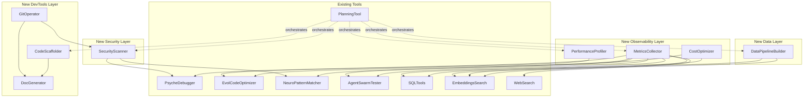

# OpenManus Tool Ecosystem Analysis & New Tool Proposals

## Executive Summary

After analyzing the existing tool ecosystem in OpenManus, I've identified strategic gaps and opportunities for enhancement. This document proposes 8 new tools that would significantly expand OpenManus's capabilities in observability, security, performance, data transformation, and agent collaboration.

---

## Current Tool Ecosystem Analysis

### Existing Tools (23 total)

**Code Analysis & Quality:**
- [`PsycheDebugger`](app/tool/psyche_debugger.py:19): Sentiment analysis on code comments/identifiers
- [`EvolCodeOptimizer`](app/tool/evol_optimizer.py:22): Genetic algorithm-based code optimization
- [`NeuroPatternMatcher`](app/tool/neuro_pattern_matcher.py:21): Design pattern detection using embeddings
- [`StrReplaceEditor`](app/tool/str_replace_editor.py:1): String-based code editing

**AI/ML & Search:**
- [`EmbeddingsSearchTool`](app/tool/ai_ml_tools.py:26): Vector similarity search with FAISS
- [`WebSearch`](app/tool/web_search.py:1): Multi-engine web search (Google, Bing, DuckDuckGo, Baidu)

**Database Operations:**
- [`SQLConnect`](app/tool/sql_tools.py:21), [`SQLQuery`](app/tool/sql_tools.py:89), [`SQLInsert`](app/tool/sql_tools.py:146), [`SQLUpdate`](app/tool/sql_tools.py:223), [`SQLDelete`](app/tool/sql_tools.py:282)
- [`SchemaViewer`](app/tool/sql_tools.py:339)

**Agent Orchestration:**
- [`AgentSwarmTester`](app/tool/agent_swarm_tester.py:18): Multi-agent testing via PyAutoGen
- [`CreateChatCompletion`](app/tool/create_chat_completion.py:1): LLM interaction
- [`AskHuman`](app/tool/ask_human.py:1): Human-in-the-loop interaction

**Execution & Browser:**
- [`Bash`](app/tool/bash.py:1): Shell command execution
- [`PythonExecute`](app/tool/python_execute.py:1): Python code execution
- [`BrowserUseTool`](app/tool/browser_use_tool.py:1): Browser automation
- [`ComputerUseTool`](app/tool/computer_use_tool.py:1): Computer control
- [`Crawl4aiTool`](app/tool/crawl4ai.py:1): Web crawling

**Project Management:**
- [`PlanningTool`](app/tool/planning.py:14): Task planning and tracking

**Misc:**
- [`Terminate`](app/tool/terminate.py:1): Task termination

---

## Identified Gaps & Opportunities

### 1. **System Observability & Monitoring**
Currently missing comprehensive monitoring, metrics collection, and system health tracking.

### 2. **Security & Validation**
Limited security scanning, vulnerability detection, or input validation tools.

### 3. **Performance Profiling**
No dedicated performance analysis beyond evolutionary optimization.

### 4. **Data Transformation & Pipeline**
Missing ETL capabilities, data validation, and transformation pipelines.

### 5. **Code Generation & Scaffolding**
No template-based code generation or project scaffolding tools.

### 6. **Version Control Integration**
Missing Git operations and code review capabilities.

### 7. **Documentation Generation**
No automated documentation generation from code.

### 8. **Cost & Resource Optimization**
No tools for tracking LLM API costs or resource usage optimization.

---

## Proposed New Tools

### 🔍 **1. MetricsCollector**

**Purpose:** Collect, aggregate, and analyze system metrics for observability

**Key Capabilities:**
- Track tool execution times, success rates, and error patterns
- Monitor memory usage, CPU utilization, and API call counts
- Generate performance reports and trend analysis
- Integration with existing tools for automatic metric collection
- Export metrics in Prometheus/Grafana format

**Parameters:**
```python
{
    "metric_type": "execution_time" | "error_rate" | "resource_usage" | "api_cost",
    "tool_name": str,  # Optional: filter by specific tool
    "time_range": {"start": datetime, "end": datetime},
    "aggregation": "sum" | "avg" | "min" | "max" | "percentile",
    "export_format": "json" | "prometheus" | "grafana"
}
```

**Use Cases:**
- Identify performance bottlenecks in agent workflows
- Track LLM API costs over time
- Monitor tool reliability and success rates
- Generate SLA compliance reports

**Integration Points:**
- Wraps existing tools to collect execution metrics
- Integrates with [`PlanningTool`](app/tool/planning.py:14) for workflow analytics
- Exports to external monitoring systems

---

### 🛡️ **2. SecurityScanner**

**Purpose:** Scan code and configurations for security vulnerabilities

**Key Capabilities:**
- Static code analysis for common vulnerabilities (SQL injection, XSS, etc.)
- Dependency scanning for known CVEs
- Secret detection in code/configs (API keys, passwords)
- Security best practice validation
- Integration with OWASP guidelines

**Parameters:**
```python
{
    "scan_type": "sast" | "dependency" | "secrets" | "best_practices",
    "code_paths": List[str],
    "severity_threshold": "critical" | "high" | "medium" | "low",
    "exclude_patterns": List[str],
    "fix_suggestions": bool
}
```

**Use Cases:**
- Pre-deployment security validation
- Continuous security monitoring in CI/CD
- Compliance checking (PCI-DSS, SOC2)
- Secret leak prevention

**Integration Points:**
- Works with [`StrReplaceEditor`](app/tool/str_replace_editor.py:1) to auto-fix issues
- Integrates with [`PlanningTool`](app/tool/planning.py:14) for remediation planning
- Complements [`PsycheDebugger`](app/tool/psyche_debugger.py:19) for code quality

---

### ⚡ **3. PerformanceProfiler**

**Purpose:** Deep performance analysis and optimization recommendations

**Key Capabilities:**
- CPU/memory profiling of Python code
- Async/await pattern analysis
- Database query optimization suggestions
- Algorithm complexity analysis (time/space)
- Bottleneck identification with call graphs

**Parameters:**
```python
{
    "profile_type": "cpu" | "memory" | "io" | "database" | "complexity",
    "code_content": str,
    "entry_point": str,  # Function/method to profile
    "sample_inputs": List[Any],
    "visualization": bool,  # Generate flame graphs
    "optimization_level": "conservative" | "aggressive"
}
```

**Use Cases:**
- Optimize slow agent workflows
- Reduce API call latency
- Identify memory leaks
- Database query optimization

**Integration Points:**
- Enhances [`EvolCodeOptimizer`](app/tool/evol_optimizer.py:22) with profiling data
- Works with [`PythonExecute`](app/tool/python_execute.py:1) for runtime profiling
- Feeds into [`MetricsCollector`](#-1-metricscollector) for trend analysis

---

### 🔄 **4. DataPipelineBuilder**

**Purpose:** Create, validate, and execute data transformation pipelines

**Key Capabilities:**
- ETL pipeline construction (Extract, Transform, Load)
- Data validation with schema enforcement
- Format conversion (JSON, CSV, Parquet, SQL, etc.)
- Data quality checks and anomaly detection
- Pipeline orchestration and scheduling

**Parameters:**
```python
{
    "pipeline_stages": List[{
        "stage_type": "extract" | "transform" | "load" | "validate",
        "source": str | dict,
        "destination": str | dict,
        "transformations": List[dict],
        "validation_rules": dict
    }],
    "error_handling": "stop" | "skip" | "retry",
    "parallel_execution": bool,
    "checkpoint_enabled": bool
}
```

**Use Cases:**
- Prepare data for ML model training
- Database migration and synchronization
- Data quality monitoring
- API response transformation

**Integration Points:**
- Works with [`SQLConnect`](app/tool/sql_tools.py:21) for database operations
- Integrates with [`EmbeddingsSearchTool`](app/tool/ai_ml_tools.py:26) for data preparation
- Uses [`Bash`](app/tool/bash.py:1) for external tool execution

---

### 🏗️ **5. CodeScaffolder**

**Purpose:** Generate project structures, boilerplate code, and templates

**Key Capabilities:**
- Project scaffolding from templates (FastAPI, React, etc.)
- Boilerplate code generation (models, APIs, tests)
- Custom template support (Jinja2-based)
- Multi-file generation with relationships
- Code style consistency enforcement

**Parameters:**
```python
{
    "template_type": "fastapi_project" | "react_app" | "python_package" | "custom",
    "project_name": str,
    "output_path": str,
    "config": {
        "package_manager": "pip" | "poetry" | "npm" | "yarn",
        "testing_framework": "pytest" | "unittest" | "jest",
        "linting": bool,
        "docker": bool
    },
    "custom_template_path": str  # Optional
}
```

**Use Cases:**
- Rapid project initialization
- Standardize project structures
- Generate CRUD APIs from schemas
- Create test boilerplate

**Integration Points:**
- Uses [`StrReplaceEditor`](app/tool/str_replace_editor.py:1) for code modifications
- Integrates with [`PlanningTool`](app/tool/planning.py:14) for multi-step scaffolding
- Works with [`Bash`](app/tool/bash.py:1) for dependency installation

---

### 📚 **6. DocGenerator**

**Purpose:** Automated documentation generation from code and context

**Key Capabilities:**
- Extract docstrings and generate API documentation
- Generate README files from project structure
- Create architecture diagrams (Mermaid, PlantUML)
- Generate OpenAPI/Swagger specs from code
- Changelog generation from Git history

**Parameters:**
```python
{
    "doc_type": "api" | "readme" | "architecture" | "changelog" | "tutorial",
    "source_paths": List[str],
    "output_format": "markdown" | "html" | "pdf" | "openapi",
    "include_examples": bool,
    "diagram_format": "mermaid" | "plantuml" | "graphviz",
    "style_guide": "google" | "numpy" | "sphinx"
}
```

**Use Cases:**
- Keep documentation in sync with code
- Generate API documentation automatically
- Create onboarding materials
- Compliance documentation

**Integration Points:**
- Analyzes code with AST parsing
- Uses [`NeuroPatternMatcher`](app/tool/neuro_pattern_matcher.py:21) for architecture insights
- Generates diagrams for [`PlanningTool`](app/tool/planning.py:14)

---

### 🔀 **7. GitOperator**

**Purpose:** Git version control operations and code review automation

**Key Capabilities:**
- Git operations (clone, commit, push, pull, branch, merge)
- Diff analysis and conflict resolution
- Automated code review (style, complexity, security)
- PR/MR creation and management
- Blame analysis and history tracking

**Parameters:**
```python
{
    "operation": "clone" | "commit" | "push" | "branch" | "merge" | "diff" | "review",
    "repo_path": str,
    "branch": str,
    "commit_message": str,
    "review_config": {
        "check_style": bool,
        "check_security": bool,
        "check_tests": bool,
        "auto_approve_threshold": float
    }
}
```

**Use Cases:**
- Automated code reviews
- CI/CD integration
- Version control for agent-generated code
- Collaboration workflows

**Integration Points:**
- Works with [`SecurityScanner`](#-2-securityscanner) for PR reviews
- Uses [`Bash`](app/tool/bash.py:1) for Git commands
- Integrates with [`PlanningTool`](app/tool/planning.py:14) for release planning

---

### 💰 **8. CostOptimizer**

**Purpose:** Track, analyze, and optimize LLM API costs and resource usage

**Key Capabilities:**
- Token usage tracking per tool/agent/task
- Cost estimation for planned operations
- Budget alerts and limits
- Model selection optimization (cost vs. quality)
- Caching strategy recommendations

**Parameters:**
```python
{
    "action": "track" | "estimate" | "optimize" | "report",
    "model_name": str,
    "token_usage": {"prompt": int, "completion": int},
    "time_range": {"start": datetime, "end": datetime},
    "budget_limit": float,
    "optimization_strategy": "minimize_cost" | "maximize_quality" | "balanced"
}
```

**Use Cases:**
- Control runaway costs in agent workflows
- Optimize model selection for tasks
- Generate cost reports for stakeholders
- Implement caching strategies

**Integration Points:**
- Tracks all LLM-based tools ([`CreateChatCompletion`](app/tool/create_chat_completion.py:1), [`AgentSwarmTester`](app/tool/agent_swarm_tester.py:18))
- Feeds into [`MetricsCollector`](#-1-metricscollector)
- Works with [`PlanningTool`](app/tool/planning.py:14) for budget-aware planning

---

## Tool Ecosystem Visualization



---

## Implementation Priority Matrix

| Tool | Impact | Feasibility | Priority |
|------|--------|-------------|----------|
| MetricsCollector | High | High | **P0** |
| SecurityScanner | High | Medium | **P0** |
| CostOptimizer | High | High | **P0** |
| PerformanceProfiler | Medium | Medium | **P1** |
| DataPipelineBuilder | Medium | Medium | **P1** |
| DocGenerator | Medium | High | **P1** |
| CodeScaffolder | Low | High | **P2** |
| GitOperator | Low | Medium | **P2** |

---

## Technical Implementation Considerations

### Common Infrastructure Needs

1. **Base Tool Pattern**: All tools extend [`BaseTool`](app/tool/base.py:78) and return [`ToolResult`](app/tool/base.py:38)
2. **Async Support**: Use `async def execute()` for I/O-bound operations
3. **Error Handling**: Leverage [`ToolFailure`](app/tool/base.py:180) for consistent error reporting
4. **Integration**: Add to [`ToolCollection`](app/tool/tool_collection.py:10) and [`__init__.py`](app/tool/__init__.py:1)
5. **Testing**: Create test files in [`app/tool/tests/`](app/tool/tests/)

### Dependencies to Add

- **MetricsCollector**: `prometheus_client`, `pandas`
- **SecurityScanner**: `bandit`, `safety`, `semgrep`
- **PerformanceProfiler**: `py-spy`, `memory_profiler`, `snakeviz`
- **DataPipelineBuilder**: `pandas`, `pydantic`, `prefect` (optional)
- **CodeScaffolder**: `cookiecutter`, `jinja2`
- **DocGenerator**: `sphinx`, `mkdocs`, `pydoc-markdown`
- **GitOperator**: `gitpython`, `pygithub`
- **CostOptimizer**: `tiktoken`, `sqlalchemy`

---

## Next Steps

1. **Review & Prioritize**: Validate tool proposals with stakeholders
2. **Technical Design**: Create detailed specs for P0 tools
3. **Prototype**: Build POCs for MetricsCollector, SecurityScanner, CostOptimizer
4. **Integration**: Ensure seamless integration with existing tool ecosystem
5. **Documentation**: Create comprehensive docs for each new tool
6. **Testing**: Implement unit and integration tests

---

## Conclusion

These 8 new tools address critical gaps in the OpenManus ecosystem:
- **Observability** through metrics and profiling
- **Security** through scanning and validation
- **Cost efficiency** through tracking and optimization
- **Developer productivity** through scaffolding and documentation
- **Data management** through pipelines and transformations

Together with the existing 23 tools, this would create a comprehensive, production-ready AI agent platform capable of handling complex, real-world development workflows.
